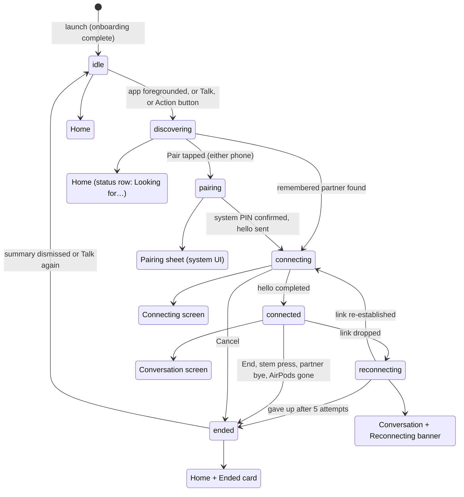

# Sotto UX/UI specification

*Version 1.0, 10 September 2026. Written against iOS 27.0 RC and the Xcode 27 SDK. Replaces the placeholder views in `Sotto/Sources/Views/`. Companion documents: `docs/PLAN.md`, `docs/research/04-ios27-platform.md`, `docs/research/05-product-ux-prior-art.md`, `docs/adr/`.*

## 1. Purpose and how to use this spec

This document is the build reference for the `Sotto` app target: every screen, every system surface, every string, and the rules that keep them consistent. Engineers build from it; the design pass in phase 4 refines it, it does not replace it.

How to use it:

- Screens are specified in §4 in the order a first-time user meets them. Each screen lists its SwiftUI components and the iOS 27 APIs to use. Where an API is named, it has been checked against Apple documentation for the 27 SDK; where I could not confirm something it is marked **unconfirmed** and an alternative is given.
- Session states come from `SottoCore.SessionState` and are not renamed here. §3 maps each state to exactly one screen.
- All copy in §8 is canonical. Do not paraphrase it in code; put it in a `Localizable.xcstrings` catalogue keyed by the identifiers in the table.
- Anything not covered here follows the iOS 27 Human Interface Guidelines (sources in §10). Where this spec and the HIG conflict, the HIG wins and the spec should be amended.

## 2. Design principles

1. **Disappear.** Every design choice is judged by whether it lets the user forget the app exists; the plan's goal is zero taps after the first pairing and a phone that stays in a pocket, so screens exist to confirm and recover, not to be looked at.
2. **It is a call, so it looks like a call.** The lock screen, Dynamic Island and AirPods stem press are provided by LiveCommunicationKit, and the in-app Conversation screen borrows the Phone app's grammar (name, status, one mute, one red end) because users already know it.
3. **One big mute, never push-to-talk.** Full-duplex is the whole product; the only in-conversation control that matters is mute, so it is the largest thing on the screen and every other control is secondary.
4. **Never rely on sound alone.** The app targets rooms too loud to hear in, and doubles as an assistive listening aid, so every audible state (partner talking, connected, link lost) has a visible and, where sensible, a haptic counterpart, and captions are a first-class feature rather than an accessibility afterthought.
5. **Say what we cannot fix.** AirPods settings, Voice Isolation and Wi-Fi in Airplane Mode have no API, so the app tells the user plainly, once, with a direct route to the right system setting, instead of pretending or nagging.
6. **Glass for controls, not for content.** Liquid Glass is applied only to the floating control layer, as the HIG directs, so the talking indicator, captions and cards stay flat and legible in a dim restaurant.

## 3. Information architecture and navigation

### 3.1 Surfaces

| Surface | Owner | When |
| --- | --- | --- |
| Onboarding (5 pages) | App, `fullScreenCover` | First launch only; re-openable from Settings › About |
| Home | App, root of a single `NavigationStack` | Idle, discovering, ended |
| Pairing sheet | System `DevicePicker` / `DevicePairingView` inside an app sheet | Pairing |
| Connecting | App, replaces Home in place | Connecting |
| Conversation | App, replaces Home in place | Connected, reconnecting |
| AirPods checklist card | App, inline card on Conversation and on Onboarding page 2; also a sheet from Settings | First session; whenever the route looks wrong |
| Ended summary | App, card on Home | Ended, until dismissed or next session |
| Settings | App, `sheet` from Home toolbar | On demand |
| Lock screen call UI, Dynamic Island | System, LiveCommunicationKit | Connecting through ended |
| Control Centre control, Action button | System, WidgetKit control + App Intent | Any time |
| Guest join (QR / App Clip) | Phase 4 note only | Later |

There is **no tab bar**. The app has one job and three screens; a tab bar would add a persistent glass layer with nothing to put in it. Settings is a sheet, not a tab. There is no custom navigation bar background anywhere (the HIG asks apps to remove custom bar backgrounds under Liquid Glass; source: Adopting Liquid Glass, https://developer.apple.com/documentation/technologyoverviews/adopting-liquid-glass).

### 3.2 Session state to screen



Rules:

- `discovering` is **not** a separate screen. Home shows a status row so the zero-tap path never looks like a modal wait.
- `reconnecting` never leaves the Conversation screen. Throwing the user back to Home during a two-second Wi-Fi Aware hiccup is the single worst thing this app could do.
- The transition Home → Connecting → Conversation is one continuous in-place replacement (`.transition(.opacity)` plus a `GlassEffectContainer` morph of the Talk button into the control cluster; see §6). No pushes, no sheets.
- Foregrounding the app while `connected` always lands on Conversation. Tapping the Live Activity or lock-screen call UI also lands on Conversation (`widgetURL`/scene activation goes to `sotto://conversation`).

## 4. Screen-by-screen specifications

Common to every screen: system background (`Color(.systemBackground)`), standard layout margins, `NavigationStack` with an inline title, no custom bar backgrounds, `ViewThatFits` for any horizontal button row at accessibility sizes, all text in Dynamic Type text styles, all tappable elements at least 44 × 44 pt (HIG default control size; source: https://developer.apple.com/design/human-interface-guidelines/accessibility).

### 4.1 Onboarding

**Goal.** Get a first-time user from install to a live conversation in under sixty seconds with the right AirPods settings, asking for the microphone in context and nothing else.

Per the HIG, keep it short, optional, and teach by doing (https://developer.apple.com/design/human-interface-guidelines/onboarding). Five pages, a page indicator, one primary button per page, a `Skip` only on pages 1 and 5. Pages 2 to 4 cannot be skipped because they are the setup, but each is one tap.

```
┌──────────────────────────────┐
│ (status bar)          Skip   │
│                              │
│         [SF symbol]          │
│                              │
│  Title (title, semibold,     │
│  left-aligned)               │
│  Body (body, secondary)      │
│                              │
│  [inline live status card]   │  ← pages 2 and 4 only
│                              │
│         ● ○ ○ ○ ○            │
│  ┌──────────────────────┐    │
│  │      Continue        │    │  .glassProminent, .controlSize(.extraLarge)
│  └──────────────────────┘    │
└──────────────────────────────┘
```

Typography follows the iOS 26/27 direction of bolder, left-aligned onboarding text (WWDC25 356: "now bolder and left-aligned to improve readability in key moments like alerts and onboarding", https://developer.apple.com/videos/play/wwdc2025/356/).

| Page | Symbol | Title | Body | Live element | Button |
| --- | --- | --- | --- | --- | --- |
| 1 | `airpods.pro` | Talk normally in a loud room. | Sotto sends your voice from your AirPods straight to your partner's AirPods, over a direct link between your iPhones. No Wi-Fi network, no mobile signal. | none | Continue |
| 2 | `ear` | Put your AirPods in. | Switch on Noise Cancellation, and turn off Conversation Awareness and Adaptive Audio for the conversation. | Route card: "AirPods Pro connected" (green tick) or "No AirPods detected" (grey, with "Continue anyway" secondary link); checklist card (§4.6) collapsed | Continue |
| 3 | `mic` | Your voice goes to one person. | Sotto needs the microphone to send your voice live to your partner. Nothing is recorded or stored on either phone. | Pre-alert only; tapping the button shows the system microphone alert | Allow Microphone |
| 4 | `iphone.gen3.radiowaves.left.and.right` | Pair once. | Hold your phones near each other. One of you taps Pair; the other confirms the code. You only do this once. | Route to §4.3 Pairing sheet. Status card shows the partner's phone name when found | Pair |
| 5 | `checkmark.circle` | You're set. | Your own voice will sound a little muffled with Noise Cancellation on. That is normal. The orange microphone dot stays on while you talk. | none | Start Talking |

States:

- Page 2, no AirPods: route card grey with `ear.trianglebadge.exclamationmark`; primary button still enabled (some users pair first and put AirPods in at the table). See §9 "first launch with no AirPods".
- Page 3, permission denied: body swaps to "Sotto can't hear you without the microphone." and the button becomes "Open Settings" (`UIApplication.openSettingsURLString`).
- Page 4, no partner found in 20 s: status card reads "Nobody nearby yet. Make sure Sotto is open on the other iPhone." Button stays "Pair". A "Do this later" link appears under it.
- Page 4 on an iPhone 11 (no Wi-Fi Aware): body is replaced with the BLE variant (§8) and the Bluetooth permission is requested here, in context.

Interactions: horizontal paging via `TabView(.page)` with `indexDisplayMode: .always`; pages 2 to 4 also advance on completion of their task. Reduce Motion: page transition is a crossfade instead of a slide.

Haptics: `.sensoryFeedback(.success, trigger: routeDetected)` on page 2 when AirPods appear; `.success` on page 4 when pairing completes.

VoiceOver: reading order symbol (decorative, `accessibilityHidden(true)`), title, body, live card, page indicator ("Page 2 of 5"), button. The live route card is an `accessibilityElement(children: .combine)` with the label "AirPods Pro connected, Noise Cancellation state unknown".

Dynamic Type: at AX3 and above the symbol shrinks to 44 pt and the body scrolls (`ScrollView` wrapping title and body; button pinned below via `safeAreaInset(edge: .bottom)`).

Components: `TabView`, `Label`, `Button` with `.buttonStyle(.glassProminent)` and `.controlSize(.extraLarge)`, `AVAudioSession.currentRoute` observation for the route card, `AVAudioApplication.requestRecordPermission()` for the microphone.

### 4.2 Home

**Goal.** Be the screen the user sees for two seconds while the app auto-connects, and the place to start or pair when it does not.

```
┌──────────────────────────────┐
│ Sotto                    ⚙   │  inline nav title; gear = Settings sheet
│                              │
│  ┌──────────────────────┐    │
│  │ ◉ Looking for Sam…   │    │  status row (discovering) or Ended card
│  └──────────────────────┘    │
│                              │
│  Partners                    │  section header, only if ≥1 partner
│  ┌──────────────────────┐    │
│  │ S  Sam           ›   │    │  tap = Talk to Sam
│  │    Last talked Tue   │    │
│  ├──────────────────────┤    │
│  │ J  Jo            ›   │    │
│  └──────────────────────┘    │
│                              │
│  ┌──────────────────────┐    │
│  │ 🎙  Talk to Sam      │    │  .glassProminent, extraLarge
│  └──────────────────────┘    │
│  ┌──────────────────────┐    │
│  │  +  Pair a new partner│   │  .glass
│  └──────────────────────┘    │
└──────────────────────────────┘
```

Elements:

- **Status row.** Shown while `discovering`: a small `ProgressView` and "Looking for Sam…" (or "Looking for partners…" when more than one is remembered). Uses `.font(.subheadline)`, secondary colour, on a `Color(.secondarySystemBackground)` rounded rect (radius 16). Not glass.
- **Partners list.** `List` with `.listStyle(.insetGrouped)`, one row per `Partner` sorted by `lastSeen`. Leading initial in a 36 pt circle (`Color.accentColor.opacity(0.15)` fill, accent text). Subtitle "Last talked Tuesday" via `Date.RelativeFormatStyle`. Swipe action "Forget" (destructive) with a confirmation dialog. Tapping a row starts a conversation with that partner.
- **Talk button.** Label "Talk to Sam" (last partner) or "Talk" if there is exactly one partner not yet talked to. Hidden when there are no partners. `.buttonStyle(.glassProminent)`, `.controlSize(.extraLarge)`, symbol `mic.fill`. This is the one tinted control on the screen (HIG: apply the accent colour to the background of the single primary action, https://developer.apple.com/design/human-interface-guidelines/color).
- **Pair button.** "Pair a New Partner", `.buttonStyle(.glass)`, `.controlSize(.large)`, symbol `plus`. Becomes the primary (prominent) button when there are no partners.
- **Empty state** (no partners): a centred `ContentUnavailableView` with `airpods.pro`, title "No partners yet", description "Pair once, then every conversation is one tap.", and the Pair button as its action.
- **Ended card.** See §4.10.
- **Error line.** `session.lastError` rendered as a footnote under the status row in `.secondary`, never red; errors that need action become the alert in §9.

Behaviour: on `scenePhase == .active`, if `autoConnect` is on and at least one partner is remembered, dispatch `.start` immediately; the user sees the status row, then Connecting. If the user taps Talk during discovering, nothing changes except the row copy becomes "Connecting to Sam…" (the tap is already implied).

Haptics: none on Home. The connect haptic fires on the Conversation screen.

VoiceOver: title, Settings button ("Settings"), status row (live region, `accessibilityAddTraits(.updatesFrequently)`), partners list (each row "Sam, last talked Tuesday, button"), Talk, Pair.

Dynamic Type: the two buttons stack vertically at all sizes; at AX sizes the list row initial is hidden and the subtitle wraps.

Components: `NavigationStack`, `.toolbar { ToolbarItem(placement: .topBarTrailing) { Button("Settings", systemImage: "gearshape") } }`, `List`, `ContentUnavailableView`, `.buttonStyle(.glassProminent)`, `.buttonStyle(.glass)`, `.confirmationDialog`. The two bottom buttons live in a single `GlassEffectContainer(spacing: 12)` so the Talk button can morph into the Conversation control cluster (`glassEffectID("primary", in: ns)`).

### 4.3 Pairing

**Goal.** Get a system-secured pairing with one tap on one phone and one confirmation on the other, and make the "both tapped Pair" race look intentional.

Flow (from ADR-0006): both phones are already publishing and browsing when Home is showing. The person who taps Pair becomes the subscriber and sees the system `DevicePicker`; the other phone, as publisher, has a `DevicePairingView` armed and the system shows its PIN sheet when selected. DeviceDiscoveryUI on iOS 26+ presents its connection UI modally and handles the PIN ("both frameworks prompt the user to enter a pairing code", Apple forum 792143; API: https://developer.apple.com/documentation/devicediscoveryui).

Sheet layout (our chrome around the system views):

```
┌──────────────────────────────┐
│ Pair                   Cancel│  sheet, .presentationDetents([.medium, .large])
│                              │
│  Hold the phones close       │  headline
│  together. Only one of you   │
│  needs to tap Pair.          │  body, secondary
│                              │
│  ┌──────────────────────┐    │
│  │ [DevicePicker label] │    │  system view; label = "Pair"
│  └──────────────────────┘    │
│                              │
│  Waiting for Sam's iPhone…   │  status line (publisher side)
└──────────────────────────────┘
```

- **Subscriber side** (tapped Pair): `DevicePicker(.wifiAware(.connecting(to: .sottoService, from: .selected([]))))` with our label view "Pair" (`.glassProminent`) and a fallback view "Pairing isn't available on this iPhone." The picker's completion hands back the endpoint; the sheet dismisses; state moves to `connecting`.
- **Publisher side**: `DevicePairingView(.wifiAware(.connecting(to: .sottoService, from: .selected([]))))` with a label view that is a passive status card "Waiting for the other iPhone…" and the same fallback. The system PIN sheet appears over it when the partner selects this phone.
- **Race**: if both tapped Pair, `PairingRace` resolves roles by nonce. The loser's picker is dismissed programmatically and the sheet body changes to the publisher layout with the headline "Only one of you needs to tap." (`accessibility` announcement fires). No error styling; this is normal.
- **Cancel** dismisses the sheet and returns to `discovering`.
- **Not supported** (`DevicePickerSupportedAction` environment value is false, or `WACapabilities.supportedFeatures` lacks Wi-Fi Aware): sheet shows the BLE pairing variant: a six-digit code in `.largeTitle.monospacedDigit()` on the publisher and a six-field code entry on the subscriber. Bluetooth permission is requested here, in context.
- **Guest without the app (phase 4 note)**: a "Show a code for a guest" link under the picker presents a full-screen QR (`qrcode` symbol in the link) carrying a `WASharedSecret` that opens the App Clip. Not in v1; leave the link out until the App Clip ships.

Haptics: `.success` when the endpoint arrives; `.warning` when the race demotes this phone.

VoiceOver: title, body, Pair button, status line (live). The system views carry their own labels.

Components: `DevicePicker`, `DevicePairingView`, `.sheet`, `.presentationDetents`, `ContentUnavailableView` for fallbacks. Wi-Fi Aware never runs in the simulator; the sheet shows the fallback there.

### 4.4 Connecting

**Goal.** Cover the one to three seconds between link and hello without looking broken, and give one way out.

```
┌──────────────────────────────┐
│                              │
│                              │
│           ( S )              │  avatar 120 pt, ring pulsing accent
│            Sam               │  title2 semibold
│        Connecting…           │  subheadline secondary
│                              │
│         over Wi-Fi           │  caption2, or "over Bluetooth"
│                              │
│                              │
│         ┌────────┐           │
│         │   ✕    │           │  End/cancel, 64 pt, red, glass
│         └────────┘           │
└──────────────────────────────┘
```

- Same avatar geometry as Conversation so the morph is seamless.
- "Connecting…" is replaced by "Reconnecting… (2 of 5)" when entered from `reconnecting`, but that case normally stays on Conversation (§4.5).
- After 10 s: subtitle becomes "Taking longer than usual." and a secondary "Try Bluetooth instead" button appears if Wi-Fi Aware is the current link.
- After 30 s or on failure: state goes `ended(.failed)` and Home shows the Ended card with the reason.

Haptics: none until connected.

VoiceOver: "Sam, connecting over Wi-Fi", then the End button ("Cancel connecting"). Announce "Connected to Sam" on transition.

Components: `ProgressView` is not used; the ring animation (§6) is the progress cue, with a hidden `ProgressView` exposed to VoiceOver only via `accessibilityRepresentation`. LiveCommunicationKit: `StartConversationAction` is fulfilled here on the initiator and `JoinConversationAction` on the joiner; report `.conversationStartedConnecting(.now)` on entry and `.conversationConnected(.now)` on `helloCompleted` (delegate pattern from WWDC26 226, https://developer.apple.com/videos/play/wwdc2026/226/).

### 4.5 Conversation

**Goal.** Confirm at a glance who you are talking to and whether they can hear you, then let the phone go back in the pocket.

```
┌──────────────────────────────┐
│ ‹ Sotto            [BT only] │  inline title; trailing badge only on BLE
│                              │
│  ┌──────────────────────┐    │
│  │ ⚠ AirPods checklist  ›│   │  card, first session or wrong route
│  └──────────────────────┘    │
│                              │
│            ( S )             │  avatar 160 pt, green ring when talking
│             Sam              │  title2 semibold
│      Talking · 12:34         │  subheadline; "Listening" when quiet
│                              │
│  ▂▃▅  link  🔋 82 %          │  caption row: link bars, partner AirPods battery
│                              │
│  ┌──────────────────────┐    │
│  │ Sam: …so if we leave │    │  captions strip (when enabled)
│  │ at eight we can…     │    │
│  └──────────────────────┘    │
│                              │
│   ┌──────┐  ╭──────╮  ┌───┐  │
│   │      │  │  🎙  │  │ ✕ │  │  glass cluster: [Captions] [Mute 88pt] [End 64pt]
│   └──────┘  ╰──────╯  └───┘  │
│      ▁▂▃▅▃▂▁ your voice      │  own level, 4 pt capsule under Mute
└──────────────────────────────┘
```

Elements, top to bottom:

1. **Navigation bar.** Title "Sotto"; the back chevron is hidden (`navigationBarBackButtonHidden`) because leaving means ending. Trailing item: the **Bluetooth-only badge**, a capsule `Label("Bluetooth only", systemImage: "dot.radiowaves.left.and.right")` in `.caption` on `.glass` button style; tapping opens the Wi-Fi prompt (§9). Note: SF Symbols has no Bluetooth glyph (trademark), hence the radio-waves symbol. Nothing else goes in the bar.
2. **AirPods checklist card** (§4.6), shown on the user's first three sessions and whenever the input route is not an AirPods HFP route. Dismissable with "Done" for the session.
3. **Partner identity.** Avatar circle 160 pt with the initial in `.system(size: 64, weight: .semibold, design: .rounded)`; fill `Color(.tertiarySystemFill)`. Ring: 6 pt `strokeBorder`, `Color.green` while `partnerIsTalking`, otherwise `Color(.separator)`. Name in `.title2.weight(.semibold)`. Status line `.subheadline` secondary: "Talking" / "Listening" / "Muted" (partner muted, from the control channel) / "Reconnecting…", followed by " · " and the elapsed timer in `.monospacedDigit()`.
4. **Quality row.** `.caption` secondary: `Image(systemName: "cellularbars", variableValue: linkQuality)` with a text label "Good" / "Fair" / "Poor" (never colour alone), then the partner's AirPods battery from the control channel as `battery.75percent`-style symbol plus percentage, hidden when unknown. No latency, buffer or concealment numbers in release builds; those stay behind a debug flag.
5. **Captions strip.** Shown when captions are on (Settings) or Live Captions-style need is detected (never auto-on). A rounded rect (radius 20) on `Color(.secondarySystemBackground)`, opaque, three lines max, `.title3` text, newest at the bottom, speaker prefix "Sam:" in `.secondary`. Not glass, not a material: captions must stay legible against anything. Long-press copies the last minute; nothing is stored beyond the session unless the user shares it.
6. **Control cluster.** One `GlassEffectContainer(spacing: 20)` holding three circular buttons: Captions toggle (56 pt, `captions.bubble` / `captions.bubble.fill`), **Mute** (88 pt, `mic.fill` / `mic.slash.fill`, `.glassEffect(.regular.interactive())`, tinted `.orange` only while muted), and **End** (64 pt, `phone.down.fill`, white on `Color.red`, `.buttonStyle(.glassProminent).tint(.red)`). Mute is centred and largest; End is trailing so an accidental thumb lands on Mute, not End.
7. **Own level.** A 4 pt capsule `Gauge(value: level, in: 0...1)` with `.gaugeStyle(.accessoryLinearCapacity)`, accent tint, 120 pt wide, beneath Mute; replaced by the word "Muted" in `.caption2` orange while muted. This is a "can they hear me" reassurance, not a VU meter.

States:

- **Reconnecting**: a banner slides under the navigation bar: `arrow.triangle.2.circlepath` + "Reconnecting… (2 of 5)" on `Color(.systemYellow).opacity(0.2)`; avatar ring goes grey; captions strip pauses with "…"; Mute stays enabled; End stays enabled.
- **Partner muted**: status "Muted" with `mic.slash` prefix; ring never turns green.
- **AirPods removed** (own): auto-mute, Mute button shows muted, status card §9.
- **Loading**: none; the screen is only shown when connected.
- **Disabled**: Captions toggle disabled with a `.help`-style footnote if speech recognition permission was denied ("Captions need speech recognition. Open Settings.").

Interactions:

- Tap Mute: toggles local mute, sends `ControlMessage.mute`, and reports `MuteConversationAction` to LiveCommunicationKit so the system UI matches. AirPods stem press arrives as a `MuteConversationAction` or `EndConversationAction` from the system and updates this screen the same way.
- Tap End: no confirmation; ends immediately (Phone app behaviour). Fulfil `EndConversationAction`.
- Tap Captions: toggles the strip; first time triggers the speech recognition permission in context.
- Lock the phone: nothing changes; the system call UI takes over.

Haptics (see §6): `.success` on entry from Connecting; `.impact(weight: .light)` on mute and unmute; `.warning` on entering reconnecting; `.impact(weight: .medium)` on End. No haptic on partner talk turns.

VoiceOver reading order: Bluetooth badge (if present), checklist card, partner element (combined: "Sam, talking, 12 minutes 34 seconds, link good, AirPods battery 82 percent"; `accessibilityValue` updates with talking state, `.updatesFrequently` trait), captions strip (live region, `accessibilityAddTraits(.updatesFrequently)`; VoiceOver users can also turn captions off to avoid double reading), Captions button, Mute button ("Mute", value "on"/"off"), End button ("End conversation"), own level ("Your voice level, medium" or "Muted"). Announce via `AccessibilityNotification.Announcement`: "Connected to Sam", "Muted", "Unmuted", "Reconnecting", "Connection restored".

Dynamic Type: name and status scale; avatar fixed at 160 pt down to 120 pt at AX sizes; the control cluster uses `ViewThatFits` and drops the Captions button into the navigation bar at AX3+; captions strip grows to five lines at AX sizes.

Components: `GlassEffectContainer`, `.glassEffect(.regular.interactive())`, `.buttonStyle(.glassProminent)`, `Gauge`, `Image(systemName:variableValue:)`, `.contentTransition(.symbolEffect(.replace))` for the mute icon, `TimelineView(.periodic(from:by: 1))` for the timer, `AccessibilityNotification.Announcement`, `SpeechAnalyzer` + `SpeechTranscriber` (iOS 26) for captions on the decoded incoming stream. Reference frame: 402 × 874 pt (iPhone 17 / 17 Pro); must also fit 390 × 844 (16e), 420 × 912 (Air) and 440 × 956 (17 Pro Max) (sizes from https://useyourloaf.com/blog/iphone-17-screen-sizes/; iPhone 18 Pro announced 9 September 2026, points **unconfirmed**).

### 4.6 AirPods checklist card

**Goal.** Get the five settings we cannot set ourselves right, once, with as little text as possible.

```
┌──────────────────────────────────┐
│ ⚠  Check your AirPods settings   │  headline
│                                  │
│ ✓ Noise Cancellation: On         │
│ ✗ Conversation Awareness: Off    │
│ ✗ Adaptive Audio: Off            │
│ ✗ Personalised Volume: Off       │
│ ✗ Loud Sound Reduction: Off      │
│ ○ Connect to This iPhone:        │
│   When Last Connected            │
│                                  │
│ [Open AirPods Settings]  [Done]  │
└──────────────────────────────────┘
```

- Rows are a static list in `.subheadline`, with the desired state in bold. The leading glyph is a fixed `checkmark.circle` for "on" items and `xmark.circle` for "off" items (they describe the target state, not detection; we cannot read these toggles and must not imply we can).
- "Open AirPods Settings" opens `App-prefs:Bluetooth` if it resolves, otherwise the Settings app root; **unconfirmed** that iOS 27 still honours the Bluetooth URL scheme, so the fallback must exist. Copy under the button: "Settings › [your AirPods name]" using the route's `portName`.
- "Done" hides the card for this session; a "Don't show again" appears from the third showing.
- The card is also available from Settings › AirPods checklist as a sheet, where it is the whole sheet.
- Why each setting matters is one tap away: a `DisclosureGroup` "Why?" with a sentence per row (copy in §8). Collapsed by default.
- Never glass. `Color(.secondarySystemBackground)`, radius 20, warning icon `exclamationmark.triangle.fill` in `.orange`.

VoiceOver: card is a group; each row reads "Noise Cancellation, should be on". Buttons last.

### 4.7 Settings

**Goal.** Six things and nothing else (plan §3.6).

```
┌──────────────────────────────┐
│ Settings                Done │  sheet, .large detent
│                              │
│ PARTNERS                     │
│  S  Sam        Last Tuesday  │  swipe or Edit → Forget
│  J  Jo         3 weeks ago   │
│                              │
│ CONVERSATIONS                │
│  Connect automatically  [on] │  Toggle
│  Captions               [off]│  Toggle
│  Voice Isolation            ›│  opens system mic mode picker
│                              │
│ AIRPODS                      │
│  AirPods checklist          ›│  §4.6 sheet
│                              │
│ ABOUT                        │
│  Version 1.0 (123)           │
│  Show introduction again    ›│
│  Privacy                    ›│  one screen of plain text
└──────────────────────────────┘
```

- `Form` in a sheet. Footer texts (in `.footnote`): under Connect automatically, "Sotto starts connecting to a remembered partner as soon as you open it."; under Captions, "Captions are made on this iPhone from your partner's voice and are not saved."; under Voice Isolation, "Voice Isolation is a system setting for the microphone. Sotto can open the picker but can't switch it on for you."
- Voice Isolation row calls `AVCaptureDevice.showSystemUserInterface(.microphoneModes)` (https://developer.apple.com/documentation/avfoundation/avcapturedevice/systemuserinterface/microphonemodes) and shows the current `AVCaptureDevice.preferredMicrophoneMode` as its value text ("Voice Isolation" / "Standard" / "Wide Spectrum"). The picker only works while the audio session is capturing; if tapped outside a conversation, show the footnote "Available during a conversation." and disable the row.
- Forget partner: `.swipeActions` destructive "Forget" and a confirmation dialog: "Forget Sam? You'll need to pair again to talk." Forgetting removes our record; the system's `WAPairedDevice` remains under Settings › Privacy & Security › Paired Devices, and the dialog says so in its message.
- No account, no notifications toggle, no theme, no audio quality settings.

VoiceOver: standard `Form` semantics. Toggles announce their footers as hints (`accessibilityHint`).

### 4.8 Lock-screen call UI, Dynamic Island and Live Activity

**What the system provides.** With LiveCommunicationKit the conversation "gets a full-screen presentation on the Lock Screen, complete with the contact's name, photo, and a standard set of controls", and the Dynamic Island for multitasking (WWDC26 226, https://developer.apple.com/videos/play/wwdc2026/226/). We control: the partner's display name (`Handle(type: .generic, value: partner.id, displayName: partner.displayName)`), our template icon (`ConversationManager.Configuration.iconTemplateImageData`, a monochrome PNG of the app glyph, 60 pt at 3x), `supportsVideo: false`, `includesConversationInRecents: true`, `maximumConversationGroups: 1`, `maximumConversationsPerConversationGroup: 1`, and no custom ringtone (the joiner does not ring; the join is automatic).

Presentation by state:

| State | Lock screen | Dynamic Island | Tap |
| --- | --- | --- | --- |
| connecting | Full-screen: name, "Sotto", "connecting…", End | Compact: leading app glyph, trailing timer placeholder | Opens Conversation |
| connected | Full-screen: name, timer, Mute, Speaker, Keypad, More, End (system set) | Compact: leading glyph (green tint), trailing timer; expanded on long-press with the system controls | Opens Conversation |
| reconnecting | Same as connected; we report no state change to the system, only our in-app banner | Same | Opens Conversation |
| ended | Removed by the system | Removed | – |

Two consequences engineers must accept: the system shows Speaker and Keypad buttons that mean nothing here (there is no `Configuration` flag to hide them in the API I could confirm; **unconfirmed** whether iOS 27 exposes one, list as open question), and the Dynamic Island content is system-designed. Do **not** also start an ActivityKit Live Activity for the same conversation in v1: two activities from the same app fall into the minimal presentation and the island becomes two small blobs.

**Fallback Live Activity (ActivityKit) specification.** Built only if phase 3 shows the system call presentation is missing on the lock screen (ADR-0005) or for the China storefront if CallKit has to be used. Follows the HIG for Live Activities (https://developer.apple.com/design/human-interface-guidelines/live-activities):

- Compact leading: partner initial in a 24 pt circle, green when talking, grey when quiet. Compact trailing: elapsed time `.monospacedDigit()`. "Design them to read as a single piece of information" (HIG).
- Minimal: the initial circle only, colour as above.
- Expanded: `DynamicIslandExpandedRegion(.leading)` avatar 44 pt; `.center` name and status ("Talking" / "Listening" / "Reconnecting…"); `.trailing` timer; `.bottom` a two-button row Mute / End using `Button(intent:)` with the same App Intents as the control (§4.9). `keylineTint(.green)`.
- Lock screen banner: same as expanded, 14 pt margins, tested on a dark wallpaper and on Always-On.
- iOS 27 landscape: when `isDynamicIslandLimitedInWidth` is true, compact views drop the timer and show only the initial (WWDC26 223, https://developer.apple.com/videos/play/wwdc2026/223/).
- `widgetURL(URL(string: "sotto://conversation"))` on every presentation; both compact halves open the same screen.
- Update only on talking-state, mute and link changes; not on level. End the activity within 2 s of `ended`.

### 4.9 Control Centre control and Action button

- A `ControlWidget` using `StaticControlConfiguration(kind: "org.shadowtech.sotto.talk", provider: LastPartnerProvider())` whose `ControlValueProvider` supplies the last partner's name, and a `ControlWidgetButton(action: TalkToLastPartnerIntent())` with `Label("Talk to \(name)", systemImage: "mic.fill")`; `previewValue` "Talk". Controls "execute an action, launch your app to a specific view … from Control Center, the Lock Screen, or by using the Action button" (https://developer.apple.com/documentation/widgetkit/creating-controls-to-perform-actions-across-the-system).
- `TalkToLastPartnerIntent: AppIntent` with `static let openAppWhenRun = true`, title "Talk to Last Partner"; `perform()` sets a pending-start flag the app reads on activation and dispatches `.start`. The Wi-Fi Aware and audio work cannot run inside the widget extension, so the intent must open the app. A second intent `EndConversationIntent` (no app launch needed if the app is already running the call; **unconfirmed** whether an intent can drive the running app process without foregrounding it; if not, it also opens the app) backs the fallback Live Activity's buttons.
- Users assign the control to the Action button under Settings › Action Button › Controls (iOS 18+, third-party controls appear in the picker; https://www.macrumors.com/how-to/assign-control-center-iphone-action-button/). Onboarding does not mention this; Settings › About has a one-line tip.
- When no partner is remembered the control is disabled with the label "Pair in Sotto first".
- Siri: the intent is exposed as an App Shortcut with the phrases "Talk to my partner in Sotto" and "Start Sotto". No parameters in v1.

### 4.10 Ended and summary

**Goal.** Close the loop in one glance and make "again" one tap.

On `ended`, the Conversation screen crossfades to Home with the Ended card at the top:

```
┌──────────────────────────────┐
│ ✓  Conversation with Sam     │  headline
│    42 min · Wi-Fi             │  subheadline secondary
│    (reason line, if any)     │  "Sam ended the conversation."
│  [Talk again]      [Dismiss] │
└──────────────────────────────┘
```

- Reason lines by `SessionEndReason`: `userEnded` none; `partnerEnded` "Sam ended the conversation."; `linkLost` "The link was lost. Try moving the phones closer."; `audioUnavailable` "Your AirPods disconnected."; `failed` "Something went wrong. (code)".
- "Talk again" is `.glassProminent`; "Dismiss" is plain. The card auto-dismisses on the next successful connection.
- Duration under 15 s with `linkLost` or `failed` is shown with the reason and a "Try Bluetooth" secondary link when Wi-Fi Aware was the transport.
- Post-conversation summary (Foundation Models, on-device) is **not** in v1. When it ships it will be a "Summarise" link on this card that only appears if captions were on, produces a summary in a sheet, and stores nothing unless the user shares it.

Haptics: `.impact(weight: .medium)` fires on End (already, §4.5); none on the card.

VoiceOver: the card is a group announced once on arrival: "Conversation with Sam ended, 42 minutes."

## 5. Visual system

### 5.1 Liquid Glass rules for Sotto

Liquid Glass is mandatory with the 27 SDK (`UIDesignRequiresCompatibility` is ignored; https://developer.apple.com/documentation/bundleresources/information-property-list/uidesignrequirescompatibility). The HIG's core rule: "Don't use Liquid Glass in the content layer … use standard materials for elements in the content layer" and "Limit these effects to the most important functional elements in your app" (https://developer.apple.com/design/human-interface-guidelines/materials).

Glass **is** used for:

- System bars and sheets (automatic; we add no backgrounds).
- Home: Talk (`.glassProminent`) and Pair (`.glass`).
- Conversation: the control cluster (Captions, Mute, End) in one `GlassEffectContainer`, and the Bluetooth-only badge.
- Connecting: the End button.
- Onboarding: the single primary button.

Glass is **not** used for: the partner avatar and talking ring, status rows, the Ended card, the AirPods checklist, the captions strip, list rows, toggles, or any text container. These use `Color(.secondarySystemBackground)` or `Color(.tertiarySystemFill)`.

Variant: `.regular` everywhere. `.clear` is for controls over media (HIG); we have no media backgrounds. Never stack glass on glass (WWDC25 219). Never put two glass elements near each other outside one container ("glass can not sample other glass", WWDC25 323, https://developer.apple.com/videos/play/wwdc2025/323/). Tint only the primary action background (Talk, End) and the muted state of Mute; symbols and text on glass stay monochrome (HIG Color).

Apply `.glassEffect` after all other appearance modifiers on the view (Apple's performance note, https://developer.apple.com/documentation/swiftui/applying-liquid-glass-to-custom-views).

### 5.2 Colour

| Role | Token | Use |
| --- | --- | --- |
| Accent | asset catalogue `AccentColor`, light `#2F6BFF`-class blue, dark variant lighter; also supply an increased-contrast pair | Talk button background, Home partner initials, own-level gauge, toggles |
| Talking | `Color.green` (system) | Partner ring, compact-island initial, nothing else |
| Muted / warning | `Color.orange` (system) | Mute button tint while muted, checklist icon, "Muted" label |
| Destructive | `Color.red` (system) | End button only |
| Reconnecting | `Color(.systemYellow)` at 20 % for the banner fill, label in `.primary` | Banner only |
| Text | `.primary`, `.secondary` | Everything |
| Surfaces | `Color(.systemBackground)`, `Color(.secondarySystemBackground)`, `Color(.tertiarySystemFill)` | Screens, cards, avatar |

One accent, and it is never used for status. Status colours are always paired with a word or a symbol (HIG: "Avoid relying solely on color"). Provide light, dark and increased-contrast variants for the accent (HIG Color: "supply light and dark variants, and an increased contrast option for each variant").

### 5.3 Typography

System font, text styles only, never fixed sizes except the avatar initial (rounded design, 64 pt fixed, decorative). Default Large sizes from the HIG typography table (https://developer.apple.com/design/human-interface-guidelines/typography):

| Use | Style | Default |
| --- | --- | --- |
| Onboarding titles | `.title` semibold | 28 pt |
| Partner name (Conversation, Connecting) | `.title2` semibold | 22 pt |
| Captions text, checklist title | `.title3` / `.headline` | 20 / 17 pt |
| Body copy | `.body` | 17 pt |
| Status lines, list subtitles, checklist rows | `.subheadline` | 15 pt |
| Settings footers, error lines | `.footnote` | 13 pt |
| Quality row, badge, transport line | `.caption` / `.caption2` | 12 / 11 pt |

Timers and percentages use `.monospacedDigit()`. Nothing below 11 pt (HIG iOS minimum). All text supports Dynamic Type up to AX5; layouts that cannot fit switch via `ViewThatFits` rather than truncating.

### 5.4 Iconography (SF Symbols 7/8)

`airpods.pro`, `airpods.gen4`, `airpods.max` (route card by model, fallback `airpods`), `ear`, `ear.trianglebadge.exclamationmark`, `mic.fill`, `mic.slash.fill`, `phone.down.fill`, `captions.bubble`, `captions.bubble.fill`, `cellularbars` (variable value), `battery.75percent` family, `dot.radiowaves.left.and.right` (Bluetooth-only), `wifi`, `wifi.slash`, `arrow.triangle.2.circlepath`, `checkmark.circle`, `checkmark.circle.fill`, `xmark.circle`, `exclamationmark.triangle.fill`, `gearshape`, `plus`, `qrcode`, `iphone.gen3.radiowaves.left.and.right`, `laptopcomputer`, `moon.fill`, `phone.arrow.down.left`. SF Symbols 8 shipped with the WWDC26 design tools (https://developer.apple.com/wwdc26/guides/design/); the app uses only symbols that exist in SF Symbols 7 so nothing depends on 8-only additions. Mute uses `.contentTransition(.symbolEffect(.replace))`; the reconnecting symbol uses `.symbolEffect(.rotate, isActive: reconnecting)` (**unconfirmed** name; if absent use `.symbolEffect(.pulse)`).

### 5.5 Spacing and corner radii

- Screen margins: system layout margins (never hard-coded 16).
- Vertical rhythm: 8 pt grid; 24 pt between groups, 12 pt within.
- Cards: `.rect(cornerRadius: 20)`; nested elements inside cards use `ConcentricRectangle` / `.rect(corners: .containerConcentric)` so radii stay concentric with the card (Adopting Liquid Glass; WWDC25 356 "concentric shapes calculate their radius by subtracting padding from the parent's").
- Circular buttons are `Circle()`; capsule buttons are the system capsule. Do not hand-pick radii for glass controls.
- Glass container spacing: 20 pt in the Conversation cluster, 12 pt on Home.

### 5.6 Light and dark; Reduce Transparency; Increase Contrast

Both appearances are supported through semantic colours; nothing is hard-coded. Under **Reduce Transparency** the system makes glass frostier and more opaque with no work from us; we additionally set the captions strip and cards to fully opaque `Color(.secondarySystemBackground)` (they already are) and drop the 20 % yellow banner tint to a solid `Color(.systemYellow)` fill with black text. Under **Increase Contrast** the system adds borders to glass controls; we swap the accent to its increased-contrast variant, thicken the talking ring from 6 to 8 pt and draw a 1 pt `.separator` border on cards. The user's iOS 27 Liquid Glass slider is honoured automatically (SwiftUI apps "pick up the updated Liquid Glass appearance … the glass tint responds to the new system-level Liquid Glass slider"; https://developer.apple.com/videos/play/wwdc2026/269/). Verify the generated dismiss button colour on the fallback Live Activity with `activitySystemActionForegroundColor` (HIG).

## 6. Motion and haptics

Only four animations matter. Everything else uses the SwiftUI default.

| Moment | Animation | Duration | Reduce Motion alternative |
| --- | --- | --- | --- |
| Partner talking pulse | Ring colour to green and avatar scale 1.00 → 1.04 on talk start, back on talk end; driven by the `talking` control message, not by level | 120 ms ease-out in, 250 ms ease-in out | Colour change only, 120 ms crossfade, no scale |
| Connecting ring | Ring rotates a 90° arc of accent around the avatar | 1.2 s linear, repeating | Static accent ring; status text carries the progress; `ProgressView` for VoiceOver |
| Connect morph | Home's Talk button morphs into the Conversation cluster via `glassEffectID` in a shared `GlassEffectContainer`; avatar fades in | 350 ms, system spring | `glassEffectTransition(.materialize)` and a plain opacity crossfade |
| Mute toggle | Symbol replace `mic.fill` ↔ `mic.slash.fill`, glass tint fades to orange | 200 ms | Same; the replace effect is a crossfade already |

Read `@Environment(\.accessibilityReduceMotion)` and branch; never disable the state change, only the motion (HIG Accessibility: reduce "automatic and repetitive animations, including zooming, scaling").

Haptics use SwiftUI `sensoryFeedback` (values confirmed at https://developer.apple.com/documentation/swiftui/sensoryfeedback):

| Event | Feedback | Note |
| --- | --- | --- |
| AirPods detected (onboarding) | `.success` | once |
| Pairing complete | `.success` | |
| Race demoted this phone | `.warning` | with the "Only one of you" copy |
| Connected | `.success` | fires on the Conversation screen appearing |
| Mute / unmute | `.impact(weight: .light)` | also when triggered by stem press |
| Reconnecting entered | `.warning` | once per episode |
| Connection restored | `.success` | |
| End | `.impact(weight: .medium)` | |
| Link lost, gave up | `.error` | |
| Partner talking | none | HIG: haptics that play frequently "become tiresome" (https://developer.apple.com/design/human-interface-guidelines/playing-haptics) |

`start`, `stop`, `increase`, `decrease`, `levelChange`, `alignment` and `pathComplete` are declared for iOS in the documentation but their iOS effect is **unconfirmed**; do not use them. Haptics are played by the phone, not the AirPods, and the microphones are on the AirPods, so the HIG caution about haptics disturbing the microphone does not apply, but keep them to the discrete events above.

## 7. Accessibility requirements

- [ ] Every interactive element has an `accessibilityLabel` from §8 and a hit area of at least 44 × 44 pt; Mute is 88 pt.
- [ ] Reading order on each screen matches the order given in §4; decorative symbols are `accessibilityHidden(true)`.
- [ ] Partner talking state is exposed as `accessibilityValue` on the partner element with `.updatesFrequently`; connection, mute and reconnect changes are announced with `AccessibilityNotification.Announcement`.
- [ ] Captions are a first-class, user-facing feature (Settings toggle, Conversation button), on-device, speaker-labelled, in `.title3` at minimum, never behind an accessibility setting. They make the app usable by deaf and hard-of-hearing users and satisfy "dialogue and crucial information … isn't communicated through audio alone" (HIG Accessibility).
- [ ] The app works as an assistive listening aid for people with mild hearing loss because the partner's voice is picked up at their mouth and delivered under noise cancelling. Marketing and in-app copy never say "hearing aid", "hearing loss", "amplify" or "medical"; the App Store category is Utilities (research/05 §6; software hearing aids are an FDA device class).
- [ ] Dynamic Type through AX5 on every screen; no truncation; `ViewThatFits` where rows cannot fit.
- [ ] Reduce Motion alternatives from §6 implemented and tested with the setting on.
- [ ] Reduce Transparency and Increase Contrast behaviours from §5.6 tested; contrast of all text on cards ≥ 4.5:1 in both appearances.
- [ ] Differentiate Without Colour: talking, muted, link quality and reconnecting each have a symbol or word, never colour alone.
- [ ] Button Shapes on: glass buttons keep their capsule/circle outlines; text buttons ("Dismiss", "Do this later") get underlines automatically because they are `Button`s, not tappable `Text`.
- [ ] VoiceOver users can end and mute from the lock screen (system UI) and from the AirPods stem (system routing) without opening the app.
- [ ] Switch Control and Full Keyboard Access reach every control; the Conversation cluster is one focus group.
- [ ] Haptics never carry information alone; each haptic event in §6 has a visible counterpart.
- [ ] Voice Control names: "Mute", "End", "Captions", "Talk", "Pair" are the spoken labels.
- [ ] The orange microphone indicator during a session is explained on onboarding page 5.

## 8. Copy guidelines

Tone: plain, short, calm. Second person. No exclamation marks. No jargon (never "P2P", "Wi-Fi Aware", "L2CAP", "VoIP" in the UI; say "direct link", "Wi-Fi", "Bluetooth"). British English throughout: "Personalised", "Cancelling", "Colour" in any user-facing text, and "Noise Cancellation" as Apple spells the feature name in en-GB. Sentence case for everything except buttons and navigation titles, which use Title Case as iOS does. Ellipsis character (…) not three dots. Partner names are never possessive-apostrophed in status lines to avoid "Sam's's".

### 8.1 Purpose strings (Info.plist)

Per the HIG, "Aim for a brief, complete sentence that's straightforward, specific, and easy to understand. Use sentence case, avoid passive voice, and include a period at the end" (https://developer.apple.com/design/human-interface-guidelines/privacy).

| Key | String |
| --- | --- |
| `NSMicrophoneUsageDescription` | Sotto sends your voice from your AirPods to your partner's AirPods during a conversation. Nothing is recorded or stored. |
| `NSBluetoothAlwaysUsageDescription` | Sotto uses Bluetooth to carry the conversation between your two iPhones when Wi-Fi is off, such as on an aircraft. |
| `NSLocalNetworkUsageDescription` | Sotto connects directly to your partner's iPhone nearby to carry the conversation. It never uses the internet or a Wi-Fi network. |
| `NSSpeechRecognitionUsageDescription` | Sotto turns your partner's voice into captions on this iPhone. Speech is processed on the device and never leaves it. |

The local network string is included for completeness; DeviceDiscoveryUI pairing over Wi-Fi Aware does not trigger the Local Network prompt (research/04 §7), so users should never see it in v1.

### 8.2 All user-facing strings

| Key | Context | String |
| --- | --- | --- |
| `app.name` | Everywhere | Sotto |
| `onb.skip` | Onboarding pages 1, 5 | Skip |
| `onb.continue` | Onboarding | Continue |
| `onb.1.title` | Page 1 | Talk normally in a loud room. |
| `onb.1.body` | Page 1 | Sotto sends your voice from your AirPods straight to your partner's AirPods, over a direct link between your iPhones. No Wi-Fi network, no mobile signal. |
| `onb.2.title` | Page 2 | Put your AirPods in. |
| `onb.2.body` | Page 2 | Switch on Noise Cancellation, and turn off Conversation Awareness and Adaptive Audio for the conversation. |
| `onb.2.route.ok` | Page 2 card | %@ connected |
| `onb.2.route.none` | Page 2 card | No AirPods detected |
| `onb.2.route.anyway` | Page 2 link | Continue anyway |
| `onb.3.title` | Page 3 | Your voice goes to one person. |
| `onb.3.body` | Page 3 | Sotto needs the microphone to send your voice live to your partner. Nothing is recorded or stored on either phone. |
| `onb.3.button` | Page 3 | Allow Microphone |
| `onb.3.denied.body` | Page 3 | Sotto can't hear you without the microphone. |
| `onb.3.denied.button` | Page 3 | Open Settings |
| `onb.4.title` | Page 4 | Pair once. |
| `onb.4.body` | Page 4 | Hold your phones near each other. One of you taps Pair; the other confirms the code. You only do this once. |
| `onb.4.body.ble` | Page 4, no Wi-Fi Aware | Hold your phones near each other. One of you taps Pair and reads out the six-digit code; the other types it in. You only do this once. |
| `onb.4.nobody` | Page 4 card | Nobody nearby yet. Make sure Sotto is open on the other iPhone. |
| `onb.4.later` | Page 4 link | Do this later |
| `onb.5.title` | Page 5 | You're set. |
| `onb.5.body` | Page 5 | Your own voice will sound a little muffled with Noise Cancellation on. That is normal. The orange microphone dot stays on while you talk. |
| `onb.5.button` | Page 5 | Start Talking |
| `home.settings` | Toolbar | Settings |
| `home.status.looking.one` | Status row | Looking for %@… |
| `home.status.looking.many` | Status row | Looking for partners… |
| `home.status.connecting` | Status row | Connecting to %@… |
| `home.partners.header` | Section | Partners |
| `home.partner.last` | Row subtitle | Last talked %@ |
| `home.partner.never` | Row subtitle | Not talked yet |
| `home.talk.named` | Button | Talk to %@ |
| `home.talk` | Button | Talk |
| `home.pair` | Button | Pair a New Partner |
| `home.empty.title` | Empty state | No partners yet |
| `home.empty.body` | Empty state | Pair once, then every conversation is one tap. |
| `pair.title` | Sheet title | Pair |
| `pair.cancel` | Sheet | Cancel |
| `pair.headline` | Sheet | Hold the phones close together. Only one of you needs to tap Pair. |
| `pair.button` | Picker label | Pair |
| `pair.waiting` | Publisher status | Waiting for the other iPhone… |
| `pair.waiting.named` | Publisher status | Waiting for %@'s iPhone… |
| `pair.race` | Race headline | Only one of you needs to tap. |
| `pair.unsupported` | Fallback | Pairing isn't available on this iPhone. |
| `pair.code.show` | BLE publisher | Read this code to your partner |
| `pair.code.enter` | BLE subscriber | Enter the code from your partner's iPhone |
| `pair.guest` | Later phase link | Show a code for a guest |
| `conn.connecting` | Connecting | Connecting… |
| `conn.over.wifi` | Connecting | over Wi-Fi |
| `conn.over.bt` | Connecting | over Bluetooth |
| `conn.slow` | After 10 s | Taking longer than usual. |
| `conn.try.bt` | Secondary button | Try Bluetooth Instead |
| `conn.cancel.a11y` | End button label | Cancel connecting |
| `conv.talking` | Status | Talking |
| `conv.listening` | Status | Listening |
| `conv.partner.muted` | Status | Muted |
| `conv.reconnecting` | Banner and status | Reconnecting… (%d of %d) |
| `conv.restored` | Announcement | Connection restored |
| `conv.link.good` | Quality | Good |
| `conv.link.fair` | Quality | Fair |
| `conv.link.poor` | Quality | Poor |
| `conv.battery` | Quality row a11y | %@'s AirPods battery %d percent |
| `conv.bt.badge` | Badge | Bluetooth only |
| `conv.mute` | Button label | Mute |
| `conv.unmute` | Button label when muted | Unmute |
| `conv.muted.label` | Under Mute | Muted |
| `conv.end` | Button label | End conversation |
| `conv.captions` | Button label | Captions |
| `conv.captions.denied` | Footnote | Captions need speech recognition. Open Settings. |
| `conv.level.a11y` | Own level | Your voice level, %@ |
| `conv.connected.a11y` | Announcement | Connected to %@ |
| `conv.airpods.gone` | Card | Your AirPods disconnected. You're muted until they're back. |
| `conv.airpods.one` | Card | One AirPod is out. Sotto is using the other one. |
| `conv.airpods.stolen` | Card | Your AirPods switched to %@. Choose this iPhone in Control Centre to continue. |
| `conv.wifi.off.title` | Alert | Wi-Fi is off |
| `conv.wifi.off.body` | Alert | Bluetooth works, but Wi-Fi sounds better. In Airplane Mode you can turn Wi-Fi on without turning on mobile data. |
| `conv.wifi.off.open` | Alert button | Open Settings |
| `conv.wifi.off.keep` | Alert button | Keep Bluetooth |
| `conv.battery.low` | Card | Your AirPods are at %d %%. |
| `conv.call.interrupt` | Card | A phone call interrupted the conversation. Sotto will resume when it ends. |
| `check.title` | Checklist | Check your AirPods settings |
| `check.nc` | Row | Noise Cancellation: **On** |
| `check.ca` | Row | Conversation Awareness: **Off** |
| `check.aa` | Row | Adaptive Audio: **Off** |
| `check.pv` | Row | Personalised Volume: **Off** |
| `check.lsr` | Row | Loud Sound Reduction: **Off** |
| `check.connect` | Row | Connect to This iPhone: **When Last Connected** |
| `check.why` | Disclosure | Why? |
| `check.why.nc` | Why | Noise Cancellation blocks the room so you can hear your partner at a normal volume. |
| `check.why.ca` | Why | Conversation Awareness turns your partner down every time you speak. |
| `check.why.aa` | Why | Adaptive Audio and Personalised Volume change the volume on their own during the conversation. |
| `check.why.lsr` | Why | Loud Sound Reduction can clip your partner's voice in a loud room. |
| `check.why.connect` | Why | Stops a Mac or iPad taking your AirPods mid-conversation. |
| `check.open` | Button | Open AirPods Settings |
| `check.path` | Under button | Settings › %@ |
| `check.done` | Button | Done |
| `check.never` | Button | Don't Show Again |
| `set.title` | Settings | Settings |
| `set.done` | Settings | Done |
| `set.partners` | Section | Partners |
| `set.forget` | Swipe action | Forget |
| `set.forget.title` | Dialog | Forget %@? |
| `set.forget.body` | Dialog | You'll need to pair again to talk. The system pairing stays under Settings › Privacy & Security › Paired Devices. |
| `set.conversations` | Section | Conversations |
| `set.auto` | Toggle | Connect Automatically |
| `set.auto.footer` | Footer | Sotto starts connecting to a remembered partner as soon as you open it. |
| `set.captions` | Toggle | Captions |
| `set.captions.footer` | Footer | Captions are made on this iPhone from your partner's voice and are not saved. |
| `set.vi` | Row | Voice Isolation |
| `set.vi.footer` | Footer | Voice Isolation is a system microphone setting. Sotto can open the picker but can't switch it on for you. |
| `set.vi.unavailable` | Footer | Available during a conversation. |
| `set.airpods` | Section | AirPods |
| `set.checklist` | Row | AirPods Checklist |
| `set.about` | Section | About |
| `set.version` | Row | Version %@ (%@) |
| `set.intro` | Row | Show Introduction Again |
| `set.privacy` | Row | Privacy |
| `set.action.tip` | Row footer | Tip: add "Talk to %@" to the Action button under Settings › Action Button › Controls. |
| `end.title` | Card | Conversation with %@ |
| `end.meta` | Card | %@ · %@ |
| `end.partner` | Reason | %@ ended the conversation. |
| `end.link` | Reason | The link was lost. Try moving the phones closer. |
| `end.audio` | Reason | Your AirPods disconnected. |
| `end.failed` | Reason | Something went wrong. (%@) |
| `end.again` | Button | Talk Again |
| `end.dismiss` | Button | Dismiss |
| `end.try.bt` | Link | Try Bluetooth next time |
| `ctl.talk` | Control | Talk to %@ |
| `ctl.talk.preview` | Control preview | Talk |
| `ctl.disabled` | Control | Pair in Sotto first |
| `ctl.end` | Control / intent | End Conversation |
| `dnd.card` | Card | Focus is on. Sotto still works, and the other person can hear you. |
| `second.partner` | Card | %@ is nearby too. Tap to switch. |

## 9. Edge cases and error states

| Situation | Detection | Behaviour | Copy |
| --- | --- | --- | --- |
| AirPods removed (both) | `AVAudioSession.routeChangeNotification`, `.oldDeviceUnavailable` | Auto-mute within 300 ms; send `mute(true)`; card on Conversation; `.warning` haptic; after 60 s with no AirPods, end with `audioUnavailable` | `conv.airpods.gone` |
| One earbud out | Route still AirPods; ear-detection is not exposed to apps, so infer from the AirPods' own behaviour (audio continues) | No action beyond an informational card if the input level drops to silence for 5 s while the partner is talking (**heuristic**; verify in phase 3) | `conv.airpods.one` |
| AirPods switched to a Mac or iPad | Route change to built-in receiver or speaker mid-session | Auto-mute; card with the new device name if the route reports it; do not end; checklist item "Connect to This iPhone" is highlighted next session | `conv.airpods.stolen` |
| Wi-Fi off in Airplane Mode | `WACapabilities` fine but Wi-Fi radio off; `NWPathMonitor` reports no Wi-Fi interface | Connect over BLE; show the Bluetooth-only badge; tapping it shows the alert with Open Settings (`App-prefs:WIFI` if it resolves, else the Settings root; **unconfirmed** for iOS 27) and Keep Bluetooth; never nag again in the same session | `conv.wifi.off.*` |
| Link lost and reconnecting | `linkDropped` | Stay on Conversation; banner with attempt count; PLC keeps audio going for the first ~200 ms; after 5 attempts (SottoCore), end with `linkLost` | `conv.reconnecting`, `end.link` |
| Partner ended | `bye` control message | End immediately; Ended card with reason; `.impact(.medium)` | `end.partner` |
| Battery low (own AirPods) | Route accessory battery where available (**unconfirmed** API for AirPods battery in iOS 27; fall back to the partner reporting their own via control channel only) | One card at 20 %, another at 10 %; no sound | `conv.battery.low` |
| Battery low (partner's AirPods) | `battery` control message | Percentage in the quality row only; no card | – |
| Incoming phone call | `AVAudioSession.interruptionNotification` and LiveCommunicationKit reporting a system call | Send `mute(true)` and a `paused` flag over the control channel; partner sees "Muted"; on `.ended` interruption with `.shouldResume`, resume audio and unmute; if the user answers and talks longer than 2 minutes, end with `audioUnavailable` | `conv.call.interrupt` |
| Do Not Disturb / Focus | No API to detect a Focus reliably; the call still reports through LiveCommunicationKit, which Focus treats as a call | No behaviour change; one-line card the first time a session starts while the status bar shows a Focus (**unconfirmed** detection; if none, drop the card) | `dnd.card` |
| Second remembered partner nearby | Browser sees two remembered endpoints | Connect to the most recently talked-to; show a card offering to switch; switching ends the current session with `userEnded` and starts another | `second.partner` |
| First launch, no AirPods | Route is built-in mic/speaker on onboarding page 2 | Allow continuing; Conversation shows the checklist card and the status "Using iPhone microphone" in the quality row; audio plays through the receiver, not the speaker, to avoid feedback | `onb.2.route.none` |
| Microphone permission revoked mid-session | `AVAudioApplication.recordPermission` change | End with `failed("microphone")`; Ended card reason with Open Settings | `end.failed` |
| App killed by the user during a session | Process gone | Partner sees reconnecting, then `end.link`; LiveCommunicationKit clears the system UI | – |
| Both phones lock for 90 minutes | Audio engine keeps running (audio background mode) | Nothing; the timer keeps counting | – |

## 10. Open questions for the design pass, and sources

### 10.1 Open questions

1. Does the LiveCommunicationKit system UI on iOS 27 allow hiding Speaker and Keypad for an audio-only, non-telephony conversation? If not, do users find them confusing enough to justify the ActivityKit fallback?
2. Does the Dynamic Island for a LiveCommunicationKit conversation show anything we can tint or label beyond the app icon and timer? Confirm on device before designing further.
3. Can the AirPods stem press be routed to Mute rather than End, or is that a user setting? Affects the copy on onboarding page 5.
4. Is the ear-out heuristic (silence while partner talks) reliable enough to ship, or should the "one AirPod" card be dropped?
5. Own-AirPods battery: is there a supported read on iOS 27, or does the card go?
6. Do `App-prefs:` URL schemes for Wi-Fi and Bluetooth still resolve on iOS 27, and does Apple accept them in review? If not, the copy becomes a path description only.
7. Should captions default on for VoiceOver users, or off to avoid double reading?
8. Real latency (phase 0): if typical mouth-to-ear exceeds 300 ms, add the "phone on the table" mode to Home and revisit the talking pulse timing, which assumes under 250 ms.
9. Avatar: initials only, or allow a contact photo via a Contacts picker? Initials keep the privacy story simple; a photo makes the lock screen feel like a real call.
10. Name check on "Sotto" before any App Store metadata.

### 10.2 Sources used

Apple HIG and documentation:

- Materials (Liquid Glass): https://developer.apple.com/design/human-interface-guidelines/materials
- Adopting Liquid Glass: https://developer.apple.com/documentation/technologyoverviews/adopting-liquid-glass
- Applying Liquid Glass to custom views (SwiftUI): https://developer.apple.com/documentation/swiftui/applying-liquid-glass-to-custom-views
- UIDesignRequiresCompatibility: https://developer.apple.com/documentation/bundleresources/information-property-list/uidesignrequirescompatibility
- Color: https://developer.apple.com/design/human-interface-guidelines/color
- Typography: https://developer.apple.com/design/human-interface-guidelines/typography
- Layout: https://developer.apple.com/design/human-interface-guidelines/layout
- Accessibility: https://developer.apple.com/design/human-interface-guidelines/accessibility
- Onboarding: https://developer.apple.com/design/human-interface-guidelines/onboarding
- Privacy (permission requests and purpose strings): https://developer.apple.com/design/human-interface-guidelines/privacy
- Playing haptics: https://developer.apple.com/design/human-interface-guidelines/playing-haptics
- Live Activities: https://developer.apple.com/design/human-interface-guidelines/live-activities
- SensoryFeedback: https://developer.apple.com/documentation/swiftui/sensoryfeedback
- DynamicIsland (WidgetKit): https://developer.apple.com/documentation/widgetkit/dynamicisland
- Creating controls: https://developer.apple.com/documentation/widgetkit/creating-controls-to-perform-actions-across-the-system
- LiveCommunicationKit: https://developer.apple.com/documentation/livecommunicationkit and ConversationManagerDelegate: https://developer.apple.com/documentation/livecommunicationkit/conversationmanagerdelegate
- DeviceDiscoveryUI: https://developer.apple.com/documentation/devicediscoveryui
- AVCaptureDevice microphone modes UI: https://developer.apple.com/documentation/avfoundation/avcapturedevice/systemuserinterface/microphonemodes
- SF Symbols / WWDC26 design guide: https://developer.apple.com/wwdc26/guides/design/ and SF Symbols 7: https://developer.apple.com/videos/play/wwdc2025/337/

WWDC sessions:

- WWDC25 219 Meet Liquid Glass: https://developer.apple.com/videos/play/wwdc2025/219/ (notes: https://wwdcnotes.com/documentation/wwdc25-219-meet-liquid-glass/)
- WWDC25 323 Build a SwiftUI app with the new design: https://developer.apple.com/videos/play/wwdc2025/323/
- WWDC25 356 Get to know the new design system: https://developer.apple.com/videos/play/wwdc2025/356/
- WWDC26 269 What's new in SwiftUI: https://developer.apple.com/videos/play/wwdc2026/269/
- WWDC26 226 Create live communication experiences: https://developer.apple.com/videos/play/wwdc2026/226/
- WWDC26 223 Live Activities essentials: https://developer.apple.com/videos/play/wwdc2026/223/ (summary: https://wwdc.ai/2026/223)

Other:

- iPhone 17 screen sizes in points: https://useyourloaf.com/blog/iphone-17-screen-sizes/
- Action button and third-party controls: https://www.macrumors.com/how-to/assign-control-center-iphone-action-button/
- Liquid Glass accessibility behaviour (Reduce Transparency, Increase Contrast): https://www.createwithswift.com/exploring-a-new-visual-language-liquid-glass/
- Wi-Fi Aware pairing code prompt: https://developer.apple.com/forums/thread/792143

Not confirmed this session (marked inline): a `Configuration` flag to hide Speaker/Keypad in the LiveCommunicationKit UI; whether `App-prefs:` URLs resolve on iOS 27; an iOS 27 API for own-AirPods battery; iOS behaviour of `SensoryFeedback.start/.stop/.increase/.decrease`; the `.rotate` symbol effect name; iPhone 18 Pro logical screen size; whether an App Intent can end a running conversation without foregrounding the app.
