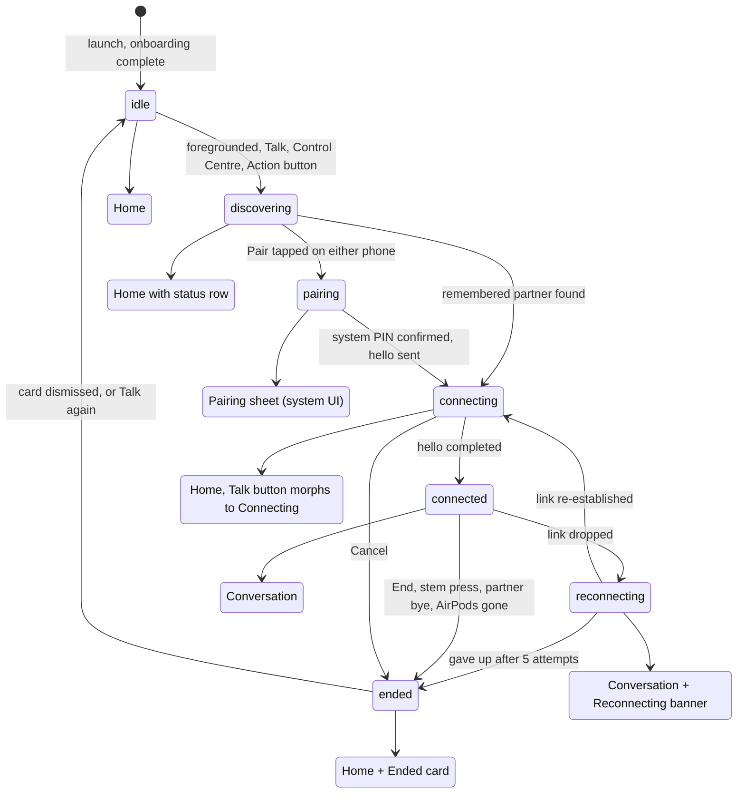

# Sotto UX/UI specification

*Version 1.1, 11 September 2026. Written against iOS 27.0 RC and the Xcode 27 SDK. Replaces the placeholder views in `Sotto/Sources/Views/`. Companions: `docs/PLAN.md` (§3, §4.5 to §4.8), `docs/research/04-ios27-platform.md`, `docs/research/05-product-ux-prior-art.md`, `docs/adr/`.*

## 1. Purpose and how to use this spec

This is the build reference for the `Sotto` app target: every screen, every system surface, every user-facing string, and the rules that keep them consistent. Engineers build phase 3 and phase 4 from it. The phase 4 design pass refines it and must update it rather than diverge from it.

- Session states are `SottoCore.SessionState` (`idle`, `discovering`, `pairing`, `connecting`, `connected`, `reconnecting`, `ended`). They are not renamed here; §3 maps each to exactly one screen.
- Copy in §8 is canonical. Put it in `Localizable.xcstrings` keyed by the identifiers given; do not paraphrase in code.
- Every API named here was checked against Apple documentation fetched on 11 September 2026 unless it carries the tag **[unconfirmed]**, in which case the closest confirmed alternative is given alongside. Apple's HIG pages are JavaScript-rendered; the citations below point at the public page, and the text was read through Apple's JSON data endpoint for the same page.
- Where this spec and the iOS 27 HIG conflict, the HIG wins and this file is amended.

## 2. Design principles

1. **Disappear.** The plan's goal is zero taps after first pairing and a phone that stays in a pocket, so every screen exists to confirm or recover, never to be admired.
2. **It is a call, so it looks like a call.** LiveCommunicationKit gives us the lock screen, Dynamic Island and stem press for free, and the in-app Conversation screen borrows the Phone app's grammar (name, status, one mute, one red end) because people already know it.
3. **One big mute, never push-to-talk.** Full duplex is the product; mute is the only in-conversation control that matters, so it is the largest thing on screen and everything else is secondary.
4. **Never rely on sound alone.** We are used in rooms too loud to hear in and double as an assistive listening aid, so every audible state has a visible and, where useful, a haptic twin, and captions are a first-class feature.
5. **Say what we cannot fix, once.** AirPods toggles, Voice Isolation and Wi-Fi in Airplane Mode have no API, so the app states the fact plainly with a direct route to the right system setting, then stops nagging.
6. **Glass for controls, not for content.** Liquid Glass is applied only to the floating control layer, as the HIG directs; the talking indicator, captions and cards stay flat and legible in a dim restaurant.

## 3. Information architecture and navigation

### 3.1 Surfaces

| Surface | Owner | When it appears |
| --- | --- | --- |
| Onboarding (5 pages) | App, `OnboardingView` | First launch only; re-entry from Settings › About › "Show introduction again" |
| Home | App, `HomeView` | `idle`, `discovering`, `ended` |
| Pairing | System (`DevicePairingView` / `DevicePicker`) inside our sheet | `pairing` |
| Connecting | App, `ConnectingView` (in-place on Home) | `connecting` |
| Conversation | App, `ConversationView` | `connected`, `reconnecting` |
| Ended card | App, on Home | `ended` until dismissed |
| Settings | App, sheet from Home | Any idle state; also reachable in-conversation via the toolbar |
| Lock screen call UI, Dynamic Island, Recents | System, via LiveCommunicationKit | `connecting` through `ended` |
| Control Centre control and Action button | System, via `ControlWidget` + App Intent | Always available once one partner is remembered |

There is no tab bar. The app has one root `NavigationStack` and one modal sheet (Settings); pairing appears in a second sheet only during `pairing`. The tab-bar minimising behaviour from iOS 26 is therefore not used.

### 3.2 Session state to screen



Rules:

- `discovering` is not a separate screen. Home shows a quiet status row so the zero-tap path never looks like a modal wait.
- `reconnecting` never leaves the Conversation screen. Bouncing the user to Home during a two-second Wi-Fi Aware hiccup is the worst thing this app could do.
- Home → Connecting → Conversation is one continuous in-place replacement inside a single `GlassEffectContainer`: the Talk capsule morphs into the mute/end cluster (`glassEffectID` on both, default `.matchedGeometry` transition; source: https://developer.apple.com/documentation/swiftui/applying-liquid-glass-to-custom-views). No pushes, no sheets.
- Foregrounding while `connected`, or tapping the lock-screen call UI or the Dynamic Island, always lands on Conversation.

## 4. Screen-by-screen specifications

Common to every screen: `Color(.systemBackground)` behind content, standard layout margins, inline navigation titles with no custom bar backgrounds (the system bar picks up Liquid Glass and the scroll edge effect itself), Dynamic Type text styles only, tappable targets of at least 44 × 44 pt, and `ViewThatFits` for every horizontal button row so it stacks at accessibility sizes.

### 4.1 Onboarding

**Goal.** Get to a first conversation in under sixty seconds while asking for exactly one permission in context.

```
┌──────────────────────────────┐
│                     Skip     │
│                              │
│         [SF Symbol]          │
│                              │
│   Talk normally in a loud    │
│   room.                      │  .largeTitle, bold
│   Your voice goes from your  │  .body, secondary
│   AirPods to theirs …        │
│                              │
│         ● ○ ○ ○ ○            │  page indicator
│   ┌──────────────────────┐   │
│   │       Continue       │   │  .glassProminent
│   └──────────────────────┘   │
└──────────────────────────────┘
```

Pages (title, body key, symbol, primary action):

1. Value. `onb.1.title`, `onb.1.body`, `airpods.pro`, Continue.
2. AirPods. `onb.2.title`, `onb.2.body`, `ear`, Continue. Live route detection: when `AVAudioSession` reports a Bluetooth HFP route the symbol swaps to `checkmark.circle.fill` (tinted `.green`) and the body appends `onb.2.detected`. No AirPods is not an error; page still continues.
3. Microphone. `onb.3.title`, `onb.3.body`, `mic`, primary "Allow Microphone" which calls `AVAudioApplication.requestRecordPermission()`; the system alert follows. On denial the body swaps to `onb.3.denied` with a "Open Settings" secondary button. The Bluetooth and Local Network prompts are not requested here; they fire the first time the BLE fallback or Bonjour is actually used (HIG: request permission at the moment it is needed, https://developer.apple.com/design/human-interface-guidelines/privacy).
4. Pairing. `onb.4.title`, `onb.4.body`, `iphone.gen3.radiowaves.left.and.right`, primary "Pair Now" (opens the Pairing sheet, §4.3), secondary "Later".
5. Ready. `onb.5.title`, `onb.5.body` (own voice sounds muffled, that is normal; stem press ends), `checkmark.circle`, primary "Start".

**Interactions.** Horizontal `TabView(.page)` with swipe; Continue advances; Skip (top trailing, `.glass` button) jumps to Home and sets `onboardingComplete`. Reduce Motion: page changes cross-fade.

**Haptics.** `.selection` on page change, `.success` when the mic permission is granted.

**VoiceOver.** Order: Skip, symbol (decorative, `accessibilityHidden(true)`), title, body, page indicator ("Page 2 of 5"), primary button. Title and body are combined into one element with `.accessibilityElement(children: .combine)`.

**Dynamic Type.** Title and body wrap without truncation; at AX3 and above the symbol shrinks to 40 pt and the content scrolls.

**Components.** `TabView`, `Text`, `Image(systemName:)`, `Button` with `.buttonStyle(.glassProminent)` for the primary and `.glass` for Skip (`.glassProminent` name **[unconfirmed]** in this session; the fetched article confirms `.buttonStyle(.glass)`; if `.glassProminent` is absent use `.borderedProminent`, which adopts the new design automatically).

### 4.2 Home

**Goal.** One tap, or none, to be talking. The remembered partner is the hero; Pair is for the first time or a new person.

```
┌──────────────────────────────┐
│ Sotto                    ⚙︎  │  inline title, toolbar gear
│                              │
│   ○ Looking for Alex…        │  status row (discovering)
│                              │
│   ┌──────────────────────┐   │
│   │ (A)  Alex            │   │  partner card, flat
│   │      Last talked Tue │   │
│   └──────────────────────┘   │
│   ┌──────────────────────┐   │
│   │ (S)  Sam             │   │
│   └──────────────────────┘   │
│                              │
│   ┌ AirPods ─────────────┐   │  reminder card, only if route wrong
│   │ ⚠ Noise Cancellation │   │
│   └──────────────────────┘   │
│                              │
│        ┌────────────┐        │
│        │ ●  Talk    │        │  glass capsule, prominent
│        └────────────┘        │
│           Pair               │  plain text button
└──────────────────────────────┘
```

Elements:

- **Status row.** `discovering`: `ProgressView` + `home.status.looking` ("Looking for Alex…", or "Looking for partners…" when several are remembered). `idle` with no AirPods route: `home.status.noAirPods`. Hidden otherwise.
- **Partner list.** `List` rows, `.plain` style, one per `Partner` sorted by `lastSeen`. Avatar is a 44 pt circle with the initial in `.title3.bold()` on `Color.accent` at 20 % opacity. Tapping a row starts connecting to that partner. Swipe leading: none. Swipe trailing: "Forget" (destructive, confirmation dialog). Empty state (no partners): the list is replaced by `home.empty.title` and `home.empty.body`, and Pair becomes the prominent button.
- **AirPods reminder card.** Shown only when the audio route is not Bluetooth HFP (`home.card.airpods.title`, `.body`). Not glass: flat `RoundedRectangle(cornerRadius: 20)` filled with `Color(.secondarySystemBackground)`. Tapping opens the AirPods checklist (§4.6).
- **Talk.** A glass capsule, `.glassEffect(.regular.tint(.accent).interactive(), in: .capsule)`, label `Label("Talk", systemImage: "waveform")`. Enabled only when at least one partner exists; disabled otherwise with the label unchanged (do not hide it). Starts `discovering` if not already, then connects to the first partner found; when two are in range a confirmation `confirmationDialog` lists them (§9, second partner nearby).
- **Pair.** Plain `Button("Pair")` in `.body`, below Talk. Always enabled.
- **Toolbar.** `gearshape` trailing item opens Settings.

**States.** Loading: none, the list is local. Error: `session.lastError` renders in the Ended card, not inline.

**Transitions.** Tapping Talk or a row: the capsule's label becomes `ProgressView` + "Connecting to Alex…" in place (`connecting` state); the partner list dims to 40 % opacity and is disabled. Cancel appears as a plain button below. On `connected`, the whole screen cross-fades to Conversation and the capsule morphs into the mute/end cluster.

**Haptics.** `.impact(weight: .light)` on Talk; `.start` on connected (in Conversation).

**VoiceOver.** Order: title, Settings, status row (announced as a live region via `accessibilityAddTraits(.updatesFrequently)`), partner rows ("Alex, last talked Tuesday, button"), AirPods card, Talk, Pair.

**Dynamic Type.** Rows grow; Talk and Pair stack vertically in `ViewThatFits`; the capsule label never truncates (`.fixedSize(horizontal: false, vertical: true)`).

**Components.** `NavigationStack`, `List`, `GlassEffectContainer(spacing: 24)` around the control cluster, `glassEffect`, `confirmationDialog`, `ProgressView`.

### 4.3 Pairing

**Goal.** One PIN, once, with the system doing the consent. Either person may tap Pair; the app resolves the race.

Flow:

1. Tapping Pair presents a `.sheet` with `presentationDetents([.medium, .large])` titled "Pair". Header text `pair.header` ("Hold your phones near each other. Only one of you needs to tap Pair.").
2. The phone that tapped Pair becomes the subscriber and embeds `DevicePicker(.wifiAware(.connecting(to: .sottoService, from: .selected([]))))` with our label view (a card with `person.2.fill` and `pair.picker.label`) and a fallback view for unsupported devices. The other phone, which is already publishing while `discovering`, embeds `DevicePairingView(.wifiAware(.connecting(to: .sottoService, from: .selected([]))))` in the same sheet layout. Both are confirmed iOS 26.0+ APIs (https://developer.apple.com/documentation/devicediscoveryui). The system draws the device list and PIN; we do not restyle it.
3. **Both tapped Pair.** `SottoCore.PairingRace` compares nonces; the loser's sheet replaces the picker with `pair.race` ("Waiting for Alex, only one of you needs to tap.") and a `ProgressView`. No error styling: this is expected behaviour, not a fault.
4. On the endpoint callback the sheet dismisses itself; state moves to `connecting` and Home shows the morphing capsule.
5. Cancel: standard toolbar Cancel, returns to `discovering`.

**Error.** Wi-Fi Aware unsupported (iPhone 11) or Wi-Fi off: the fallback view shows `pair.fallback.body` with a "Use Bluetooth Instead" button that starts the BLE six-digit code flow (`pair.ble.code`, shown in `.largeTitle` monospaced digits on the publisher, entered on the subscriber; see PLAN §4.6). Both-phones-BLE pairing is phase 2 and the code UI is deliberately plain.

**Later phase note.** Guest join by QR (App Clip with `WASharedSecret`, iOS 26.4+): a "Show Code" button appears in this sheet's toolbar in phase 4, presenting a QR full-screen with `pair.qr.caption`. Not built before then.

**Haptics.** `.success` on pairing completed. **VoiceOver.** Header, then the system picker (it is accessible by default), then Cancel. **Components.** `sheet`, `DevicePicker`, `DevicePairingView`, `ProgressView`.

### 4.4 Connecting

Not a separate screen; it is Home with the Talk capsule in its connecting form (§4.2). Copy: `connecting.title` ("Connecting to Alex…"), and after eight seconds `connecting.slow` ("Still trying. Make sure Alex has Sotto open."). Cancel ends the attempt (`SessionEvent.userEnded`). The system call UI (§4.8) is already reported as outgoing at this point so the Dynamic Island shows the call from the first second.

### 4.5 Conversation

**Goal.** Glance, confirm who is talking, mute if needed, then put the phone away.

```
┌──────────────────────────────┐
│  ‹ Sotto          ⚙︎   CC    │  toolbar: Settings, Captions
│                              │
│   ┌ Bluetooth only ─── Wi-Fi ┐ │  badge, only on BLE
│                              │
│            ╭────╮            │
│           │  A   │           │  avatar 160 pt, pulse ring
│            ╰────╯            │
│             Alex             │  .title2
│          Talking · 12:04     │  .subheadline secondary
│      ▮▮▮▮▮▯▯▯  ⋅⋅⋅ ●●●○     │  own level, link quality
│                              │
│   ┌ AirPods ─────────────┐   │  checklist reminder card
│   └──────────────────────┘   │
│                              │
│   ┌──────────────────────┐   │
│   │ Alex: …the fish was  │   │  captions strip (if enabled)
│   │ great, but…          │   │
│   └──────────────────────┘   │
│                              │
│      ╭──────╮   ╭──────╮     │
│      │ mute │   │ end  │     │  glass cluster
│      ╰──────╯   ╰──────╯     │
└──────────────────────────────┘
```

Elements, top to bottom:

- **Toolbar.** Leading: none (no back; End is the exit). Trailing: `gearshape` (Settings sheet) and `captions.bubble` / `captions.bubble.fill` toggle (label "Captions", state read as "on"/"off").
- **Bluetooth-only badge.** Appears only when `connected(_, over: .bleL2CAP)`. Flat capsule, `Color(.secondarySystemBackground)`, `Label(conv.badge.bluetooth, systemImage: "wifi.slash")` plus a trailing text button "Turn On Wi-Fi" that opens the Settings app (`UIApplication.openSettingsURLString` opens our app's page; a direct Wi-Fi deep link via `App-prefs:` is **[unconfirmed]** on iOS 27 and may not pass review, so the button copy tells the user where to go: `conv.badge.wifiHint`).
- **Partner identity.** 160 pt circle avatar with initial in `.system(size: 64, weight: .semibold)`; name in `.title2`; status line in `.subheadline` secondary: "Talking", "Listening", "Muted" (partner muted), or "Reconnecting…", with the elapsed timer in monospaced digits.
- **Talking indicator.** A 6 pt ring around the avatar in `Color.talking` (§5.2) that scales 1.0 → 1.08 with the partner's level (§6). Never colour alone: the status line says "Talking" and the ring appears together.
- **Own level.** An eight-segment horizontal meter (`LevelBar`, kept from the placeholder but segmented) driven by `localLevelDBFS`. When muted the meter is replaced by `mic.slash.fill` and the text "You are muted".
- **Link quality.** Three dots, filled per `linkQuality` bucket, with an accessibility label "Link quality good/fair/poor". Latency, buffer and concealment numbers from the placeholder move behind a long-press on the dots (debug popover, `#if DEBUG` only).
- **AirPods checklist reminder card.** §4.6, shown once per install at first `connected`, and again when the route is not HFP or after the ear-out heuristic fires.
- **Captions strip.** Present only when captions are enabled. Flat rounded rectangle, `Color(.secondarySystemBackground)`, showing the last two lines from `SpeechTranscriber` on the incoming stream, prefixed with the partner's name, `.body` with `.monospacedDigit()` off. Interim results in secondary colour, finalised in primary. Scrolls in place, never grows the layout beyond three lines.
- **Control cluster.** `GlassEffectContainer(spacing: 32)` containing two 76 pt circles: Mute (`mic.fill` / `mic.slash.fill`, `.glassEffect(.regular.interactive(), in: .circle)`, tinted `.orange` when muted) and End (`phone.down.fill`, `.glassEffect(.regular.tint(.red).interactive(), in: .circle)`). Labels "Mute" / "Unmute" and "End" appear beneath in `.caption`.

**States.** `reconnecting`: a flat banner slides in under the toolbar, `conv.reconnecting` ("Reconnecting… attempt 2 of 5"), avatar ring hidden, controls stay enabled (End works during reconnect). Partner muted: status "Muted", ring hidden. AirPods removed: §9. Captions loading (model asset download on first use): strip shows `captions.preparing`.

**Interactions.** Mute toggles `MuteConversationAction` through LiveCommunicationKit so the lock screen and stem press stay in sync. End sends `EndConversationAction`; a single tap ends without confirmation, matching the Phone app. The avatar and name are not tappable. Toolbar Settings opens the sheet over the conversation without ending it.

**Haptics.** `.start` on entering `connected`; `.impact(weight: .medium)` on mute and unmute; `.stop` on End; `.warning` when `reconnecting` begins; `.success` when it recovers. No haptic on partner talking (it would fire constantly).

**VoiceOver.** Order: Bluetooth badge (if present), partner name and status as one element ("Alex, talking, 12 minutes"), own level ("Your voice level, medium" or "You are muted"), link quality, reminder card, captions (live region, `accessibilityAddTraits(.updatesFrequently)`), Mute, End, then toolbar. Talking changes are announced via `AccessibilityNotification.Announcement` at most once every ten seconds.

**Dynamic Type.** Name and status wrap; at AX sizes the avatar drops to 96 pt, the captions strip becomes a full-width scroll region, and the control cluster remains 76 pt with labels wrapping under.

**Components and APIs.** `GlassEffectContainer`, `glassEffect`, `glassEffectID`, `Label`, `TimelineView` for the timer, `SpeechAnalyzer` / `SpeechTranscriber` (iOS 26), `MuteConversationAction`, `EndConversationAction` (LiveCommunicationKit, iOS 17.4+; https://developer.apple.com/documentation/livecommunicationkit), `AVAudioSession.routeChangeNotification`.

### 4.6 AirPods checklist card

**Goal.** Tell the user the five settings we cannot set, once, in the fewest words.

Flat card (not glass), `RoundedRectangle(cornerRadius: 20)` in `Color(.secondarySystemBackground)`, title `airpods.title` ("Check your AirPods") in `.headline`, then five rows in `.subheadline`, each an `Label` with `checkmark.circle` (on) or `xmark.circle` (off) in secondary colour:

1. Noise Cancellation: on. (Not Adaptive, not Transparency.)
2. Conversation Awareness: off.
3. Adaptive Audio: off.
4. Personalised Volume: off.
5. Loud Sound Reduction: off.
6. Connect to This iPhone: When Last Connected.

Footer `airpods.footer` ("Press and hold the volume slider in Control Centre, or open Settings and tap your AirPods."), and two buttons in `ViewThatFits`: "Open Settings" (opens `UIApplication.openSettingsURLString`; deep-linking to the AirPods page is **[unconfirmed]**) and "Done". Done sets `airpodsChecklistSeen`; the card returns only on a route problem. In Settings it is reachable any time as "AirPods checklist". No haptic. VoiceOver reads title, each row as "Noise Cancellation, on", footer, buttons.

### 4.7 Settings

Sheet, `NavigationStack` inside, `Form` with inset grouped style, title "Settings", Done trailing.

| Section | Rows | Behaviour |
| --- | --- | --- |
| Partners | One row per `Partner` (avatar, name, last talked); swipe or Edit → Forget with `confirmationDialog` (`settings.forget.confirm`) | Forgetting also removes the BLE key from the Keychain; the Wi-Fi Aware pairing itself lives in Settings › Privacy & Security › Paired Devices, so a footer says so (`settings.partners.footer`) |
| Conversation | Toggle "Auto-connect to remembered partners" (default on); Toggle "Captions" (default off; on by default when VoiceOver or Live Captions is running, see §7) | Auto-connect off means Home waits for a tap on Talk |
| Voice | Row "Voice Isolation" with a `chevron.right` that calls `AVCaptureDevice.showSystemUserInterface(.microphoneModes)` (AVFoundation, iOS 15+) and a footer `settings.voice.footer` | We cannot read or set the mode; the row only opens the system UI |
| AirPods | Row "AirPods checklist" → §4.6 | |
| About | Version and build, "Show introduction again", "Privacy" (one paragraph: nothing leaves the two phones, nothing is stored) | |

Standard `Form` controls already adopt the new design; do not add glass here (HIG: standard components pick it up, custom glass should be limited to the most important functional elements, https://developer.apple.com/design/human-interface-guidelines/materials). VoiceOver and Dynamic Type come from `Form` for free. Haptic: `.selection` on toggles is supplied by the system toggle.

### 4.8 Lock-screen call UI, Dynamic Island and Live Activity

The session is reported through LiveCommunicationKit: `StartConversationAction` on the subscriber, `JoinConversationAction` on the publisher when the invite arrives over the link, `MuteConversationAction` and `EndConversationAction` for the controls (all confirmed iOS 17.4+). WWDC26 session 226 describes full-screen lock screen, Dynamic Island and Recents for LCK conversations (research/04 §4); the exact rendering is system-owned and we control only the remote participant's display name (the partner's name), the app icon and, via `ConversationManager.Configuration`, ringtone and Recents inclusion (property names **[unconfirmed]** this session; verify against the 27 SDK headers, and fall back to `CXProviderConfiguration` if LCK misbehaves, per ADR-0005).

What we specify, because it is ours to specify:

- **Lock screen.** The system call UI with the partner's name and the elapsed timer. Mute and End are the system's buttons. Tapping the app icon in that UI opens Conversation. We do not request video, grouping or hold capabilities so those buttons never appear.
- **Dynamic Island, compact.** Leading: our icon (`waveform` in the accent colour). Trailing: the timer. For an LCK call the system draws this; if we ever fall back to an ActivityKit Live Activity (only if LCK provides no island), the layout follows the HIG: leading and trailing read as one piece, snug against the camera, consistent colour and typography (https://developer.apple.com/design/human-interface-guidelines/live-activities).
- **Minimal** (two activities active): the `waveform` icon only, tinted; recognisable without text.
- **Expanded** (touch and hold): partner avatar and name leading, timer trailing, "Talking" or "Muted" centre, Mute and End buttons bottom. Tapping anywhere else opens Conversation; both leading and trailing link to the same screen, as the HIG requires.
- **Key line and colours.** Key line tinted to the accent; text medium weight or heavier; no sensitive content (captions never appear on the island or lock screen).
- **AirPods stem press.** Routed by the system to the conversation's end (or mute, depending on the user's AirPods setting; **[unconfirmed]** which actions LCK maps). The Conversation screen simply reflects whatever action arrives.
- **Recents.** Included, so the Phone app shows "Sotto · Alex · 41 min", which is the discoverability story for the second person.

### 4.9 Control Centre control and Action button

- A `ControlWidget` (WidgetKit, iOS 18+) titled "Talk" with the `waveform` symbol runs the `TalkToLastPartnerIntent`. Users assign it to Control Centre, the lock screen or the Action button from system settings; there is no in-app assignment UI.
- `TalkToLastPartnerIntent` (App Intents) has `title` "Talk to Partner" and a parameter-less path that starts `discovering` for the most recent partner, opening the app (`openAppWhenRun = true`) because Wi-Fi Aware requires the app to be running. Siri phrase suggestions: "Talk to Alex with Sotto". The intent's dialog when no partner exists: `intent.noPartner`.
- An `EndConversationIntent` is offered for Shortcuts only. Whether an intent can end a running conversation without foregrounding the app is **[unconfirmed]**; if not, it foregrounds.

### 4.10 Ended

On `ended(reason)` the app returns to Home with a flat card above the partner list: title by reason (`ended.userEnded`, `ended.partnerEnded`, `ended.linkLost`, `ended.audioUnavailable`, `ended.failed`), the duration ("41 minutes with Alex"), and two buttons: "Talk Again" (prominent glass, restarts with the same partner) and "Done" (dismiss). Haptic `.stop` once on arrival. VoiceOver announces the title on arrival. The card disappears when dismissed or after the next session starts. A phase 4 "Summarise" button (on-device Foundation Models) is a later addition and is never shown by default.

## 5. Visual system

### 5.1 Liquid Glass rules for Sotto

Building with the iOS 27 SDK makes Liquid Glass mandatory (`UIDesignRequiresCompatibility` is ignored; research/04 §1). The HIG states glass "forms a distinct functional layer for controls and navigation elements … that floats above the content layer" and says "Don't use Liquid Glass in the content layer" and to "use Liquid Glass effects sparingly" (https://developer.apple.com/design/human-interface-guidelines/materials). Applied here:

**Glass is used for:** the navigation bar and toolbar (system-provided); the Talk capsule and the Mute/End cluster (custom, `.regular` variant, one `GlassEffectContainer` per screen); the primary onboarding button and Skip. That is the complete list.

**Glass is not used for:** the partner list, avatar, talking ring, level meter, captions strip, AirPods card, reminder cards, Ended card, badges, banners, Settings rows. These are content and stay flat.

**Variant.** Always `.regular`. The `.clear` variant is "only for components that appear over visually rich backgrounds" such as media; we never have one.

**Tinting.** Tint suggests prominence, so only two glass elements are ever tinted at once: Talk (accent) on Home, End (red) in Conversation. Mute is untinted until muted, then orange.

**Corners.** Capsules for pill controls, circles for the round buttons, and `.rect(cornerRadius:)` for anything larger, keeping one consistent family per the article's guidance. Content cards use 20 pt radii inset 16 pt from screen edges so they sit concentric with the device corner; a nested element uses the parent radius minus its inset (12 pt inside a 20 pt card at 8 pt inset). Concentric-shape APIs such as `ContainerRelativeShape` and a `.rect(corners:)` concentric style are **[unconfirmed]** this session; plain fixed radii are acceptable.

**Performance.** One container per screen; nothing glass inside a `List` row (the article warns that many effects outside containers degrade performance).

### 5.2 Colour

- **Accent** (one): `Color.accent` defined in the asset catalogue as a teal-blue, light `#0A84A8` **[placeholder, design pass to finalise]**, dark `#3BB0D0`. Used for Talk, the link dots, toggles, and the avatar fill at 20 %.
- **Talking**: `Color.talking` = system `.green` (`UIColor.systemGreen`) for the ring and the "Talking" status. System colours adapt to appearance and Increase Contrast automatically (https://developer.apple.com/design/human-interface-guidelines/color).
- **Warning**: system `.orange` for mute state, the Bluetooth-only badge icon, and reconnecting banner text.
- **Destructive**: system `.red` for End and Forget.
- **Text**: `.primary`, `.secondary` only. Backgrounds: `systemBackground`, `secondarySystemBackground`. No custom greys.
- On glass, use vibrant system colours only (HIG: "use vibrant colors on top of it"); our button glyphs use `.primary` on untinted glass and `.white` on tinted glass.

### 5.3 Typography

All text uses Dynamic Type styles; no fixed point sizes except the avatar initial.

| Use | Style |
| --- | --- |
| Onboarding titles | `.largeTitle.bold()` |
| Partner name in Conversation | `.title2` |
| Section and card titles | `.headline` |
| Body, captions strip, rows | `.body` |
| Status line, checklist rows | `.subheadline` |
| Timer, latency numbers | `.subheadline.monospacedDigit()` |
| Button labels under the cluster | `.caption` |
| Avatar initial | `.system(size: 64, weight: .semibold)` scaled with `@ScaledMetric` |

Guidance: https://developer.apple.com/design/human-interface-guidelines/typography. Text never truncates; it wraps. Minimum size used is `.caption`.

### 5.4 Iconography

SF Symbols, all with `.symbolRenderingMode(.hierarchical)` unless stated. Names beyond those already in the placeholder views should be verified in the SF Symbols 7 app before use (**[unconfirmed]** names marked ?):

| Meaning | Symbol |
| --- | --- |
| App mark, Talk, Dynamic Island | `waveform` |
| AirPods | `airpods.pro` (onboarding), `ear` |
| Mute / unmute | `mic.fill` / `mic.slash.fill` |
| End | `phone.down.fill` |
| Pair | `iphone.gen3.radiowaves.left.and.right`, `person.2.fill` |
| Captions | `captions.bubble` / `captions.bubble.fill` |
| Bluetooth only | `wifi.slash` |
| Link quality | three `circle.fill` glyphs, not a symbol |
| Reconnecting | `arrow.triangle.2.circlepath` |
| Settings | `gearshape` |
| Checklist on / off | `checkmark.circle` / `xmark.circle` |
| Warning | `exclamationmark.triangle.fill` |
| Battery low | `battery.25percent` ? |
| Guest QR (phase 4) | `qrcode` |

### 5.5 Spacing and corner radii

8 pt grid. Screen margins 16 pt (system default). Vertical rhythm between stacked cards 12 pt, between sections 24 pt. Card radius 20 pt, badge and capsule radius: capsule. Round buttons 76 pt (control cluster), 44 pt minimum for everything else. Avatar 160 pt in Conversation, 44 pt in lists.

### 5.6 Light and dark; Reduce Transparency; Increase Contrast

Light and dark come from semantic colours; nothing is hard-coded. The HIG notes that glass "can differ in response to … accessibility settings that reduce transparency or increase contrast". Under Reduce Transparency the system renders glass as a more opaque material and under Increase Contrast it adds borders and raises contrast; we do nothing special except: never rely on the glass blur to separate a control from content (there is always a 16 pt gap or a card boundary), and never place text on glass in a colour lighter than `.secondary`. Test both settings on every screen; the user's Liquid Glass translucency slider (iOS 27) is a third variable to check.

## 6. Motion and haptics

Only three animations matter. Everything else uses SwiftUI defaults.

| Event | Animation | Duration | Reduce Motion alternative |
| --- | --- | --- | --- |
| Partner talking | Ring around avatar scales 1.0 → 1.08 following level, `.easeInOut` | 150 ms per update, decays over 400 ms | Ring appears and disappears with opacity only, no scale |
| Connect | Talk capsule morphs into Mute/End via `glassEffectID` + `matchedGeometry`; screen cross-fades | 350 ms | Cross-fade only (`glassEffectTransition(.materialize)` **[unconfirmed]** as the RM-friendly option; otherwise `.transition(.opacity)`) |
| Mute | Glyph swaps with `.symbolEffect(.replace)`; button tint fades to orange | 200 ms | Instant swap, tint change kept |
| Reconnecting banner | Slides down from under the toolbar | 250 ms | Fades in |

Use `withAnimation` gated on `@Environment(\.accessibilityReduceMotion)`. Symbol effects use `.symbolEffect` (SwiftUI, iOS 17+).

Haptics map to `sensoryFeedback(_:trigger:)` values, all confirmed iOS 17+ (https://developer.apple.com/documentation/swiftui/sensoryfeedback):

| Event | `SensoryFeedback` |
| --- | --- |
| Onboarding page change, list selection | `.selection` |
| Mic permission granted, pairing completed, reconnect recovered | `.success` |
| Talk tapped | `.impact(weight: .light)` |
| Connected | `.start` |
| Mute / unmute | `.impact(weight: .medium)` |
| Reconnecting began, AirPods removed, Bluetooth-only entered | `.warning` |
| Ended (any reason) | `.stop` |
| Connection failed, pairing failed | `.error` |

HIG: play haptics for meaningful events only, never continuously, and keep them consistent with the visual (https://developer.apple.com/design/human-interface-guidelines/playing-haptics). Partner-talking has no haptic.

## 7. Accessibility requirements

- [ ] Every screen passes VoiceOver with the reading orders in §4; no unlabeled buttons; decorative symbols hidden.
- [ ] Every string wraps at AX5; no truncation, no clipped buttons; `ViewThatFits` on every horizontal button row.
- [ ] All tappable elements 44 × 44 pt or larger; the control cluster 76 pt.
- [ ] Colour never carries meaning alone: talking has text, muted has a glyph and text, link quality has a label.
- [ ] Reduce Motion alternatives in §6 implemented and tested.
- [ ] Reduce Transparency and Increase Contrast tested on Home, Conversation and Settings, light and dark.
- [ ] Captions are first-class: toolbar toggle in Conversation, Settings toggle, default on when VoiceOver or system Live Captions is active, on-device only, never stored. The strip is a live region.
- [ ] Hearing-assist use: the app functions as a remote-microphone listening aid for one partner. Copy must never say "hearing aid", "hearing loss", "treat" or "medical" (software hearing aids are an FDA device class; research/05 §6). Say "hear each other clearly".
- [ ] Haptic twins for connect, disconnect, mute and reconnect so a user who cannot hear the state change feels it.
- [ ] Voice Control: all buttons have visible labels or `accessibilityLabel` matching the visible caption ("Mute", "End", "Talk", "Pair").
- [ ] Bold Text and Button Shapes respected (system styles handle it; verify custom glass buttons show shapes).
- [ ] Full keyboard access and Switch Control: Mute and End reachable in two moves from screen focus.

## 8. Copy guidelines

**Tone.** Short, plain, calm. Second person. No exclamation marks, no "oops", no jargon ("link" not "transport", "AirPods" not "route"). Sentence case for everything except the app name and Apple feature names (Noise Cancellation, Conversation Awareness, Control Centre). British English: "cancelling", "personalised", "centre", "colour", "recognise". Numbers as digits. Partner names are always interpolated, never "your partner" when a name exists.

### 8.1 Purpose strings (Info.plist)

| Key | String |
| --- | --- |
| `NSMicrophoneUsageDescription` | Sotto sends your voice from your AirPods directly to your partner's AirPods. Nothing is recorded or stored. |
| `NSBluetoothAlwaysUsageDescription` | Sotto uses Bluetooth to reach your partner's iPhone when Wi-Fi is off, such as on a plane. |
| `NSLocalNetworkUsageDescription` | Sotto connects directly to your partner's iPhone nearby. No internet or Wi-Fi network is used. |
| `NSSpeechRecognitionUsageDescription` | Sotto turns your partner's voice into captions on your iPhone. Recognition happens on this device only. |

### 8.2 User-facing strings

| Key | Context | String |
| --- | --- | --- |
| `onb.1.title` | Onboarding 1 | Talk normally in a loud room. |
| `onb.1.body` | Onboarding 1 | Your voice goes from your AirPods straight to your partner's AirPods over a direct link between your iPhones. No Wi-Fi network, no mobile signal. |
| `onb.2.title` | Onboarding 2 | Put your AirPods in. |
| `onb.2.body` | Onboarding 2 | Switch on Noise Cancellation and turn off Conversation Awareness, or your partner will get quieter every time you speak. |
| `onb.2.detected` | Onboarding 2, route found | AirPods connected. |
| `onb.3.title` | Onboarding 3 | Microphone. |
| `onb.3.body` | Onboarding 3 | Sotto needs the microphone to send your voice. Nothing is recorded or stored. |
| `onb.3.allow` | Onboarding 3 button | Allow Microphone |
| `onb.3.denied` | Onboarding 3, denied | Sotto cannot work without the microphone. You can allow it in Settings. |
| `onb.4.title` | Onboarding 4 | Pair once. |
| `onb.4.body` | Onboarding 4 | Hold your phones near each other. One of you taps Pair, the other confirms the code. You only do this once. |
| `onb.4.pair` / `onb.4.later` | Onboarding 4 buttons | Pair Now / Later |
| `onb.5.title` | Onboarding 5 | You're set. |
| `onb.5.body` | Onboarding 5 | Your own voice will sound a little muffled with Noise Cancellation on. That is normal. Press an AirPod stem to end a conversation. |
| `common.continue` / `common.skip` / `common.start` / `common.done` / `common.cancel` | Buttons | Continue / Skip / Start / Done / Cancel |
| `home.talk` | Home | Talk |
| `home.pair` | Home | Pair |
| `home.status.looking` | Home, discovering | Looking for %@… |
| `home.status.lookingAny` | Home, discovering | Looking for partners… |
| `home.status.noAirPods` | Home, idle | Put your AirPods in to talk. |
| `home.empty.title` | Home, no partners | No partners yet |
| `home.empty.body` | Home, no partners | Pair with someone once and they'll appear here. |
| `home.row.lastTalked` | Partner row | Last talked %@ |
| `home.card.airpods.title` | Home card | AirPods not connected |
| `home.card.airpods.body` | Home card | Sotto uses your AirPods microphone. Put them in and check Noise Cancellation is on. |
| `pair.title` | Pairing sheet | Pair |
| `pair.header` | Pairing sheet | Hold your phones near each other. Only one of you needs to tap Pair. |
| `pair.picker.label` | Picker label view | Choose your partner's iPhone |
| `pair.race` | Both tapped | Waiting for %@. Only one of you needs to tap. |
| `pair.fallback.body` | Unsupported | This iPhone can't pair over Wi-Fi. You can pair over Bluetooth instead. |
| `pair.ble.button` | Fallback | Use Bluetooth Instead |
| `pair.ble.code` | BLE code | Enter this code on the other iPhone |
| `pair.qr.caption` | Phase 4 | Scan to join this conversation |
| `connecting.title` | Home capsule | Connecting to %@… |
| `connecting.slow` | After 8 s | Still trying. Make sure %@ has Sotto open. |
| `conv.status.talking` / `.listening` / `.muted` | Status line | Talking / Listening / Muted |
| `conv.you.muted` | Level meter | You are muted |
| `conv.mute` / `conv.unmute` / `conv.end` | Cluster labels | Mute / Unmute / End |
| `conv.captions` | Toolbar | Captions |
| `conv.link.good` / `.fair` / `.poor` | Accessibility | Link quality good / fair / poor |
| `conv.badge.bluetooth` | Badge | Bluetooth only |
| `conv.badge.wifiHint` | Badge button | Turn on Wi-Fi in Control Centre for better quality |
| `conv.reconnecting` | Banner | Reconnecting… attempt %d of %d |
| `conv.airpodsGone.title` | Banner | AirPods disconnected |
| `conv.airpodsGone.body` | Banner | You're muted until they reconnect. |
| `conv.oneEar` | Banner | One AirPod is out. Put it back in to be heard clearly. |
| `conv.airpodsElsewhere` | Banner | Your AirPods switched to another device. Choose this iPhone in Control Centre. |
| `conv.batteryLow` | Banner | %@'s AirPods are low on battery. |
| `captions.preparing` | Strip | Preparing captions… |
| `airpods.title` | Checklist | Check your AirPods |
| `airpods.row.nc` | Checklist | Noise Cancellation: on (not Adaptive) |
| `airpods.row.ca` | Checklist | Conversation Awareness: off |
| `airpods.row.aa` | Checklist | Adaptive Audio: off |
| `airpods.row.pv` | Checklist | Personalised Volume: off |
| `airpods.row.lsr` | Checklist | Loud Sound Reduction: off |
| `airpods.row.connect` | Checklist | Connect to This iPhone: When Last Connected |
| `airpods.footer` | Checklist | Press and hold the volume slider in Control Centre, or open Settings and tap your AirPods. |
| `airpods.openSettings` | Checklist | Open Settings |
| `settings.title` | Settings | Settings |
| `settings.partners` | Section | Partners |
| `settings.partners.footer` | Footer | Wi-Fi pairings are also listed in Settings › Privacy & Security › Paired Devices. |
| `settings.forget` | Row action | Forget |
| `settings.forget.confirm` | Dialog | Forget %@? You'll need to pair again to talk. |
| `settings.autoConnect` | Toggle | Auto-connect to remembered partners |
| `settings.captions` | Toggle | Captions |
| `settings.voiceIsolation` | Row | Voice Isolation |
| `settings.voice.footer` | Footer | Voice Isolation makes your AirPods microphone ignore the room. Sotto can only open the setting, not change it. |
| `settings.airpods` | Row | AirPods checklist |
| `settings.about` / `.intro` / `.privacy` | About | About / Show introduction again / Privacy |
| `settings.privacy.body` | About | Your voice travels only between the two iPhones and is never recorded or stored. Captions are made on your iPhone. |
| `ended.userEnded` | Ended card | Conversation ended |
| `ended.partnerEnded` | Ended card | %@ ended the conversation |
| `ended.linkLost` | Ended card | Lost the link to %@ |
| `ended.audioUnavailable` | Ended card | AirPods disconnected, so the conversation ended |
| `ended.failed` | Ended card | Couldn't connect |
| `ended.duration` | Ended card | %@ with %@ |
| `ended.again` | Ended card | Talk Again |
| `dnd.note` | Home footnote when Focus is on | A Focus is on. Sotto is a call, so it will still connect. |
| `intent.title` | App Intent | Talk to Partner |
| `intent.noPartner` | App Intent dialog | Pair with someone in Sotto first. |
| `airplane.wifiOff` | Home card | Wi-Fi is off. Sotto will use Bluetooth, which sounds a little worse. Turn Wi-Fi on in Control Centre for the best quality. Airplane Mode can stay on. |
| `call.interrupted` | Banner | Paused for a phone call. Sotto will continue when it ends. |

## 9. Edge cases and error states

| Case | Detection | Behaviour |
| --- | --- | --- |
| AirPods removed (both) | Route change to built-in | Auto-mute within 2 s, banner `conv.airpodsGone`, haptic `.warning`, partner told over the control channel (their status shows "Muted"). Unmute automatically when the HFP route returns. After 60 s with no AirPods, end with `audioUnavailable`. Never route to the speaker. |
| One earbud out | Heuristic: HFP route present, input level silent for 5 s while partner is talking, or ear-detection route change | Banner `conv.oneEar`, no mute, no haptic. Drop if phase 0 shows the heuristic is unreliable (§10). |
| AirPods switched to a Mac or iPad | Route change to built-in while Bluetooth still on | Same as removed, but banner `conv.airpodsElsewhere`; the checklist row "Connect to This iPhone" is highlighted next time the card shows. |
| Wi-Fi off in Airplane Mode | `WACapabilities` unavailable or Wi-Fi radio off | Home card `airplane.wifiOff`; connect over BLE; Conversation shows the Bluetooth-only badge with the Control Centre hint. Never ask the user to turn Airplane Mode off. |
| Link lost, reconnecting | `linkDropped` | Banner with attempt count, ring hidden, `.warning` haptic once; on recovery `.success`; after 5 attempts → Ended `linkLost`. Audio plays concealment silence, never a tone. |
| Partner ended | `partnerSaidBye` | Ended card `ended.partnerEnded`, `.stop`. |
| Battery low (partner's AirPods, via control channel) | Battery message < 15 % | One banner `conv.batteryLow`, dismissable, shown once per session. Own-AirPods battery is not shown (no confirmed API). |
| Incoming phone call | LCK / audio session interruption | Sotto's conversation is held by the system; banner `call.interrupted`; resume when the interruption ends; if the call is answered and lasts over 2 minutes, end with `linkLost` rather than hold the partner indefinitely, and the partner sees `ended.partnerEnded`. |
| Do Not Disturb / Focus | System | A call reported through LCK is treated as a call by Focus; nothing to do except the footnote `dnd.note` on Home. |
| Second partner nearby | Two remembered partners discovered within 3 s | `confirmationDialog` "Who do you want to talk to?" listing both; auto-connect waits. If one appears first and connects, the second is ignored. |
| First launch with no AirPods | No HFP route during onboarding page 2 | Page continues; Home shows `home.status.noAirPods` and disables Talk until a route appears. Pairing is still allowed. |
| Mic permission denied later | `AVAudioApplication.shared.recordPermission` | Home card with "Open Settings"; Talk disabled. |
| Wi-Fi Aware pairing fails or PIN mismatch | Picker error callback | Fallback view with retry; `.error` haptic. |

## 10. Open questions for the design pass, and sources

### 10.1 Open questions

1. Does the LCK lock-screen UI on iOS 27 hide Speaker and Keypad for an audio-only, non-telephony conversation? If not, is that confusing enough to justify an ActivityKit island alongside?
2. Which `ConversationManager.Configuration` properties exist in the 27 SDK (ringtone, Recents inclusion), and does the stem press map to End or Mute?
3. Is the one-earbud heuristic reliable enough to ship, or is the banner dropped?
4. Do `App-prefs:` deep links to Wi-Fi and AirPods pages resolve on iOS 27 and pass review? If not, the copy stays as a path description.
5. Should captions default on for VoiceOver users, or does that double up speech?
6. Exact accent colour, and whether initials or a Contacts photo make the lock screen feel more like a real call.
7. If phase 0 latency lands above 300 ms, the talking pulse timing (assumes under 250 ms) and the Home layout ("phone on the table" mode) both change.
8. Name check on "Sotto".

### 10.2 Sources used

Read this session (through Apple's JSON data endpoints):

- HIG Materials (Liquid Glass): https://developer.apple.com/design/human-interface-guidelines/materials
- Applying Liquid Glass to custom views (`glassEffect`, `GlassEffectContainer`, `glassEffectID`, `glassEffectUnion`, `glassEffectTransition`, `.buttonStyle(.glass)`): https://developer.apple.com/documentation/swiftui/applying-liquid-glass-to-custom-views
- HIG Live Activities (compact, minimal, expanded, Lock Screen, tinting, tap behaviour): https://developer.apple.com/design/human-interface-guidelines/live-activities
- SensoryFeedback values and modifiers: https://developer.apple.com/documentation/swiftui/sensoryfeedback
- DeviceDiscoveryUI (`DevicePairingView`, `DevicePicker`, iOS 26.0+): https://developer.apple.com/documentation/devicediscoveryui
- LiveCommunicationKit types and actions (iOS 17.4+): https://developer.apple.com/documentation/livecommunicationkit

Cited from prior knowledge or the project's research reports, not re-fetched this session:

- HIG Colour: https://developer.apple.com/design/human-interface-guidelines/color
- HIG Typography: https://developer.apple.com/design/human-interface-guidelines/typography
- HIG Accessibility: https://developer.apple.com/design/human-interface-guidelines/accessibility
- HIG Privacy: https://developer.apple.com/design/human-interface-guidelines/privacy
- HIG Playing haptics: https://developer.apple.com/design/human-interface-guidelines/playing-haptics
- HIG Onboarding: https://developer.apple.com/design/human-interface-guidelines/onboarding
- WWDC25 219 Meet Liquid Glass: https://developer.apple.com/videos/play/wwdc2025/219/
- WWDC25 323 Build a SwiftUI app with the new design: https://developer.apple.com/videos/play/wwdc2025/323/
- WWDC26 226 Create live communication experiences: https://developer.apple.com/videos/play/wwdc2026/226/
- WWDC26 223 Live Activities essentials: https://developer.apple.com/videos/play/wwdc2026/223/
- `UIDesignRequiresCompatibility`: https://developer.apple.com/documentation/bundleresources/information-property-list/uidesignrequirescompatibility
- Controls (WidgetKit): https://developer.apple.com/documentation/widgetkit/creating-controls-to-perform-actions-across-the-system
- Microphone modes UI: https://developer.apple.com/documentation/avfoundation/avcapturedevice/systemuserinterface/microphonemodes

Not confirmed this session and marked inline: `.buttonStyle(.glassProminent)`; `ConversationManager.Configuration` property names; stem-press mapping under LCK; concentric corner APIs; `glassEffectTransition(.materialize)` as a Reduce Motion path; `App-prefs:` URL behaviour; the HIG text on Reduce Transparency and Increase Contrast beyond the sentence quoted in §5.6; a few SF Symbol names in §5.4; scroll edge effect and tab bar minimising API names (not used by this app).
